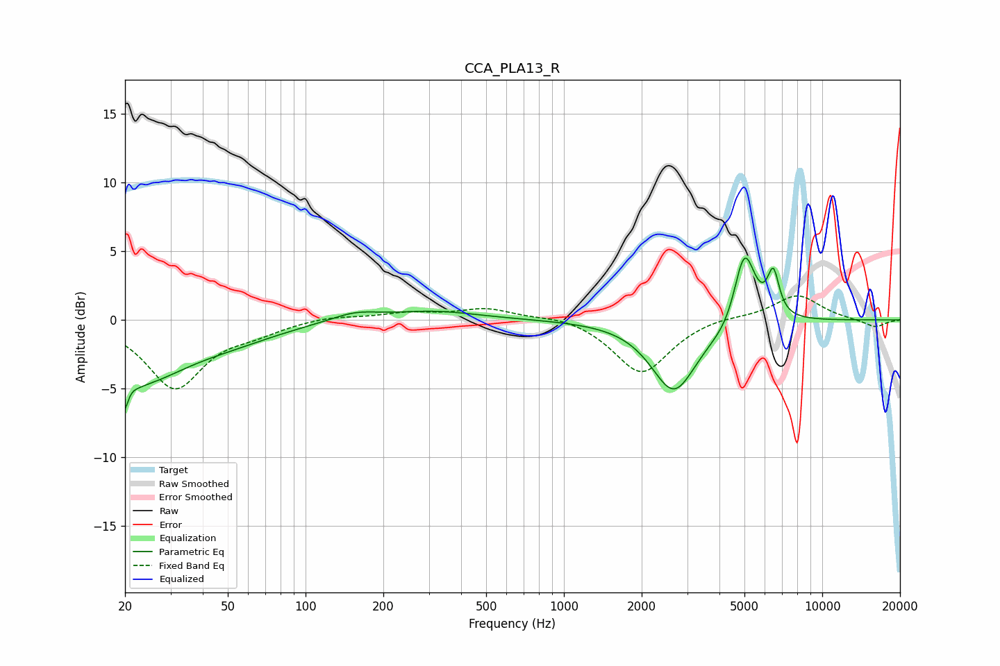

# CCA_PLA13_R
See [usage instructions](https://github.com/jaakkopasanen/AutoEq#usage) for more options and info.

### Parametric EQs
Apply preamp of -4.6 dB when using parametric equalizer.

|   # | Type    |   Fc (Hz) |    Q |   Gain (dB) |
|-----|---------|-----------|------|-------------|
|   1 | Peaking |        20 | 5.56 |        -4.9 |
|   2 | Peaking |        20 | 6    |         2.8 |
|   3 | Peaking |        22 | 0.75 |        -4.1 |
|   4 | Peaking |        52 | 0.76 |        -0.9 |
|   5 | Peaking |       155 | 1.53 |         0.6 |
|   6 | Peaking |       314 | 0.83 |         0.6 |
|   7 | Peaking |      2666 | 1.62 |        -5.2 |
|   8 | Peaking |      4423 | 2.07 |        -1.1 |
|   9 | Peaking |      4990 | 3.23 |         5.9 |
|  10 | Peaking |      6467 | 6    |         3.1 |

### Fixed Band EQs
When using fixed band (also called graphic) equalizer, apply preamp of **-1.8 dB** (if available) and set gains manually with these parameters.

|   # | Type    |   Fc (Hz) |    Q |   Gain (dB) |
|-----|---------|-----------|------|-------------|
|   1 | Peaking |        31 | 1.41 |        -4.9 |
|   2 | Peaking |        62 | 1.41 |        -0.7 |
|   3 | Peaking |       125 | 1.41 |         0.3 |
|   4 | Peaking |       250 | 1.41 |         0.5 |
|   5 | Peaking |       500 | 1.41 |         0.8 |
|   6 | Peaking |      1000 | 1.41 |         0.4 |
|   7 | Peaking |      2000 | 1.41 |        -3.9 |
|   8 | Peaking |      4000 | 1.41 |         0.3 |
|   9 | Peaking |      8000 | 1.41 |         1.8 |
|  10 | Peaking |     16000 | 1.41 |        -0.6 |

### Graphs

