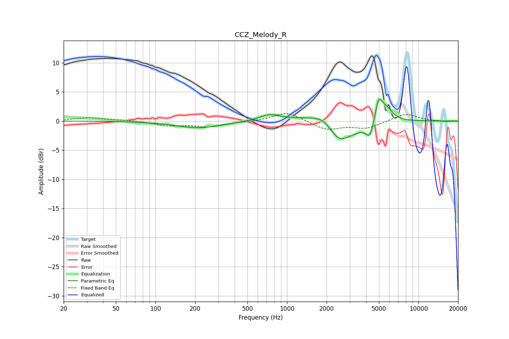

# CCZ_Melody_R
See [usage instructions](https://github.com/jaakkopasanen/AutoEq#usage) for more options and info.

### Parametric EQs
Apply preamp of -3.9 dB when using parametric equalizer.

|   # | Type    |   Fc (Hz) |    Q |   Gain (dB) |
|-----|---------|-----------|------|-------------|
|   1 | Peaking |       213 | 0.81 |        -1.2 |
|   2 | Peaking |       735 | 1.88 |         1   |
|   3 | Peaking |      1862 | 2.96 |         0.5 |
|   4 | Peaking |      2032 | 0.78 |         1.6 |
|   5 | Peaking |      2450 | 2.25 |        -1.3 |
|   6 | Peaking |      2607 | 1.37 |        -3.1 |
|   7 | Peaking |      3369 | 2.31 |        -0.6 |
|   8 | Peaking |      4278 | 4.27 |        -3   |
|   9 | Peaking |      4986 | 4.7  |         4.1 |
|  10 | Peaking |      5786 | 3.07 |         1.8 |

### Fixed Band EQs
When using fixed band (also called graphic) equalizer, apply preamp of **-1.4 dB** (if available) and set gains manually with these parameters.

|   # | Type    |   Fc (Hz) |    Q |   Gain (dB) |
|-----|---------|-----------|------|-------------|
|   1 | Peaking |        31 | 1.41 |         0.6 |
|   2 | Peaking |        62 | 1.41 |         0.1 |
|   3 | Peaking |       125 | 1.41 |        -0.7 |
|   4 | Peaking |       250 | 1.41 |        -0.9 |
|   5 | Peaking |       500 | 1.41 |        -0.1 |
|   6 | Peaking |      1000 | 1.41 |         1.6 |
|   7 | Peaking |      2000 | 1.41 |        -1.5 |
|   8 | Peaking |      4000 | 1.41 |        -1.2 |
|   9 | Peaking |      8000 | 1.41 |         1.3 |
|  10 | Peaking |     16000 | 1.41 |        -0.1 |

### Graphs

