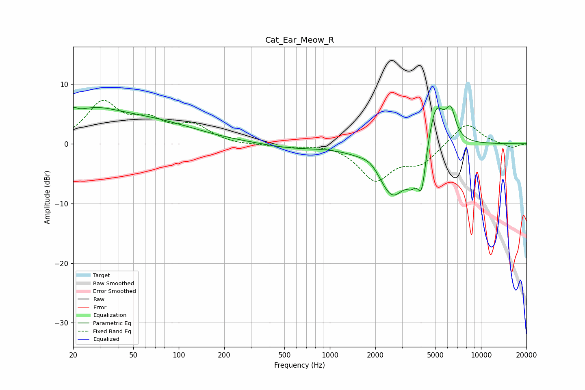

# Cat_Ear_Meow_R
See [usage instructions](https://github.com/jaakkopasanen/AutoEq#usage) for more options and info.

### Parametric EQs
Apply preamp of -6.5 dB when using parametric equalizer.

|   # | Type    |   Fc (Hz) |    Q |   Gain (dB) |
|-----|---------|-----------|------|-------------|
|   1 | Peaking |        20 | 5.84 |         1.2 |
|   2 | Peaking |        26 | 0.74 |         4.2 |
|   3 | Peaking |        65 | 0.45 |         3.3 |
|   4 | Peaking |       550 | 0.79 |        -0.7 |
|   5 | Peaking |      1884 | 2.27 |         1.4 |
|   6 | Peaking |      2595 | 1.34 |        -9   |
|   7 | Peaking |      3469 | 4.07 |        -2.4 |
|   8 | Peaking |      4053 | 4.81 |        -7.4 |
|   9 | Peaking |      5003 | 2.33 |         8.3 |
|  10 | Peaking |      6310 | 4.39 |         4.3 |

### Fixed Band EQs
When using fixed band (also called graphic) equalizer, apply preamp of **-7.4 dB** (if available) and set gains manually with these parameters.

|   # | Type    |   Fc (Hz) |    Q |   Gain (dB) |
|-----|---------|-----------|------|-------------|
|   1 | Peaking |        31 | 1.41 |         6.6 |
|   2 | Peaking |        62 | 1.41 |         3.2 |
|   3 | Peaking |       125 | 1.41 |         2.7 |
|   4 | Peaking |       250 | 1.41 |        -0.2 |
|   5 | Peaking |       500 | 1.41 |        -0.5 |
|   6 | Peaking |      1000 | 1.41 |         0.2 |
|   7 | Peaking |      2000 | 1.41 |        -5.9 |
|   8 | Peaking |      4000 | 1.41 |        -3   |
|   9 | Peaking |      8000 | 1.41 |         3.7 |
|  10 | Peaking |     16000 | 1.41 |        -0.7 |

### Graphs

