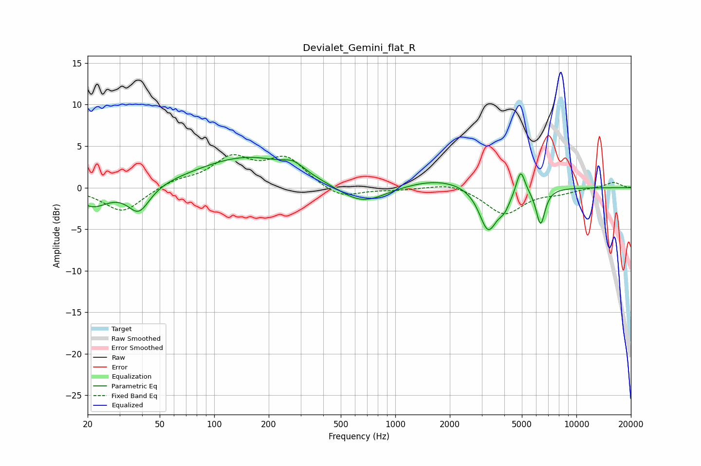

# Devialet_Gemini_flat_R
See [usage instructions](https://github.com/jaakkopasanen/AutoEq#usage) for more options and info.

### Parametric EQs
Apply preamp of -3.7 dB when using parametric equalizer.

|   # | Type    |   Fc (Hz) |    Q |   Gain (dB) |
|-----|---------|-----------|------|-------------|
|   1 | Peaking |        21 | 1.6  |        -2.2 |
|   2 | Peaking |        38 | 2.35 |        -3.2 |
|   3 | Peaking |       154 | 0.51 |         3.7 |
|   4 | Peaking |       274 | 2.58 |         0.9 |
|   5 | Peaking |       652 | 1.05 |        -2.5 |
|   6 | Peaking |      1736 | 0.71 |         1.2 |
|   7 | Peaking |      3252 | 2.86 |        -5.2 |
|   8 | Peaking |      4001 | 4.03 |        -1.6 |
|   9 | Peaking |      4923 | 6    |         2.9 |
|  10 | Peaking |      6344 | 5.55 |        -4.3 |

### Fixed Band EQs
When using fixed band (also called graphic) equalizer, apply preamp of **-4.1 dB** (if available) and set gains manually with these parameters.

|   # | Type    |   Fc (Hz) |    Q |   Gain (dB) |
|-----|---------|-----------|------|-------------|
|   1 | Peaking |        31 | 1.41 |        -3   |
|   2 | Peaking |        62 | 1.41 |         0.8 |
|   3 | Peaking |       125 | 1.41 |         3.3 |
|   4 | Peaking |       250 | 1.41 |         3.4 |
|   5 | Peaking |       500 | 1.41 |        -1.4 |
|   6 | Peaking |      1000 | 1.41 |        -0.2 |
|   7 | Peaking |      2000 | 1.41 |         0.7 |
|   8 | Peaking |      4000 | 1.41 |        -3.2 |
|   9 | Peaking |      8000 | 1.41 |        -0.5 |
|  10 | Peaking |     16000 | 1.41 |         0.7 |

### Graphs

