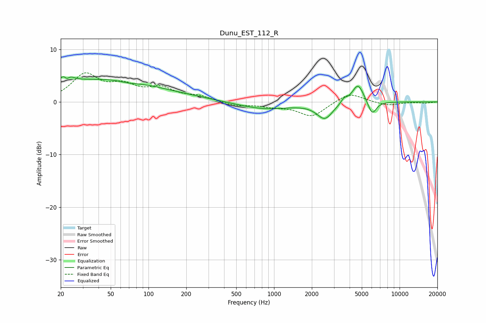

# Dunu_EST_112_R
See [usage instructions](https://github.com/jaakkopasanen/AutoEq#usage) for more options and info.

### Parametric EQs
Apply preamp of -4.9 dB when using parametric equalizer.

|   # | Type    |   Fc (Hz) |    Q |   Gain (dB) |
|-----|---------|-----------|------|-------------|
|   1 | Peaking |        22 | 4.11 |         4.1 |
|   2 | Peaking |        22 | 5.88 |        -3.1 |
|   3 | Peaking |        37 | 0.34 |         3.8 |
|   4 | Peaking |        69 | 2.14 |        -0.3 |
|   5 | Peaking |       128 | 0.4  |         1   |
|   6 | Peaking |       835 | 0.66 |        -1.4 |
|   7 | Peaking |      2536 | 2.26 |        -3   |
|   8 | Peaking |      3605 | 5.93 |         0.8 |
|   9 | Peaking |      4663 | 2.99 |         3.7 |
|  10 | Peaking |      6044 | 4.02 |        -2.7 |

### Fixed Band EQs
When using fixed band (also called graphic) equalizer, apply preamp of **-5.6 dB** (if available) and set gains manually with these parameters.

|   # | Type    |   Fc (Hz) |    Q |   Gain (dB) |
|-----|---------|-----------|------|-------------|
|   1 | Peaking |        31 | 1.41 |         5   |
|   2 | Peaking |        62 | 1.41 |         2.6 |
|   3 | Peaking |       125 | 1.41 |         2.3 |
|   4 | Peaking |       250 | 1.41 |         0.9 |
|   5 | Peaking |       500 | 1.41 |        -0.7 |
|   6 | Peaking |      1000 | 1.41 |        -0.7 |
|   7 | Peaking |      2000 | 1.41 |        -2.7 |
|   8 | Peaking |      4000 | 1.41 |         1.9 |
|   9 | Peaking |      8000 | 1.41 |        -0.7 |
|  10 | Peaking |     16000 | 1.41 |        -0.2 |

### Graphs

