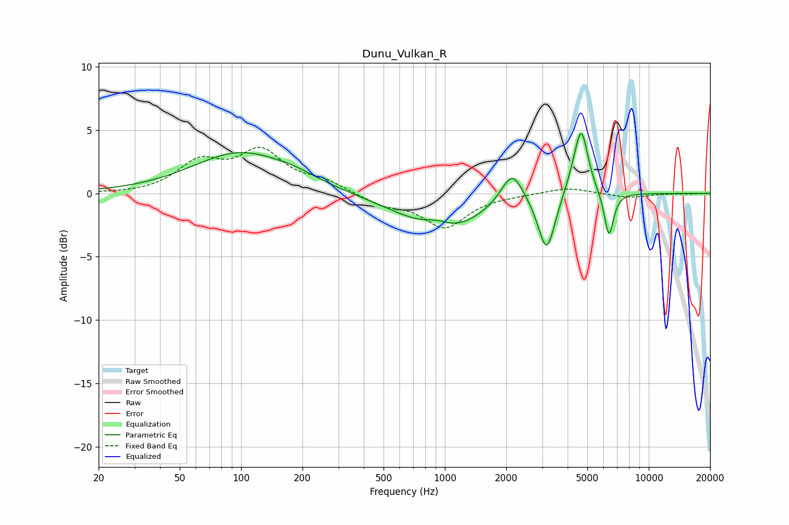

# Dunu_Vulkan_R
See [usage instructions](https://github.com/jaakkopasanen/AutoEq#usage) for more options and info.

### Parametric EQs
Apply preamp of -4.8 dB when using parametric equalizer.

|   # | Type    |   Fc (Hz) |    Q |   Gain (dB) |
|-----|---------|-----------|------|-------------|
|   1 | Peaking |        99 | 0.6  |         3.2 |
|   2 | Peaking |       187 | 1.34 |         0.4 |
|   3 | Peaking |       889 | 0.7  |        -2.4 |
|   4 | Peaking |       918 | 2.04 |         0.7 |
|   5 | Peaking |      1161 | 1.17 |        -0.8 |
|   6 | Peaking |      2136 | 2.68 |         2.6 |
|   7 | Peaking |      3158 | 3.43 |        -4.6 |
|   8 | Peaking |      4388 | 2.95 |         1.3 |
|   9 | Peaking |      4680 | 4.34 |         4.4 |
|  10 | Peaking |      6378 | 5.95 |        -3.6 |

### Fixed Band EQs
When using fixed band (also called graphic) equalizer, apply preamp of **-3.7 dB** (if available) and set gains manually with these parameters.

|   # | Type    |   Fc (Hz) |    Q |   Gain (dB) |
|-----|---------|-----------|------|-------------|
|   1 | Peaking |        31 | 1.41 |        -0.1 |
|   2 | Peaking |        62 | 1.41 |         2.3 |
|   3 | Peaking |       125 | 1.41 |         3.1 |
|   4 | Peaking |       250 | 1.41 |         0.8 |
|   5 | Peaking |       500 | 1.41 |        -0.8 |
|   6 | Peaking |      1000 | 1.41 |        -2.6 |
|   7 | Peaking |      2000 | 1.41 |        -0.1 |
|   8 | Peaking |      4000 | 1.41 |         0.5 |
|   9 | Peaking |      8000 | 1.41 |        -0.3 |
|  10 | Peaking |     16000 | 1.41 |        -0   |

### Graphs

