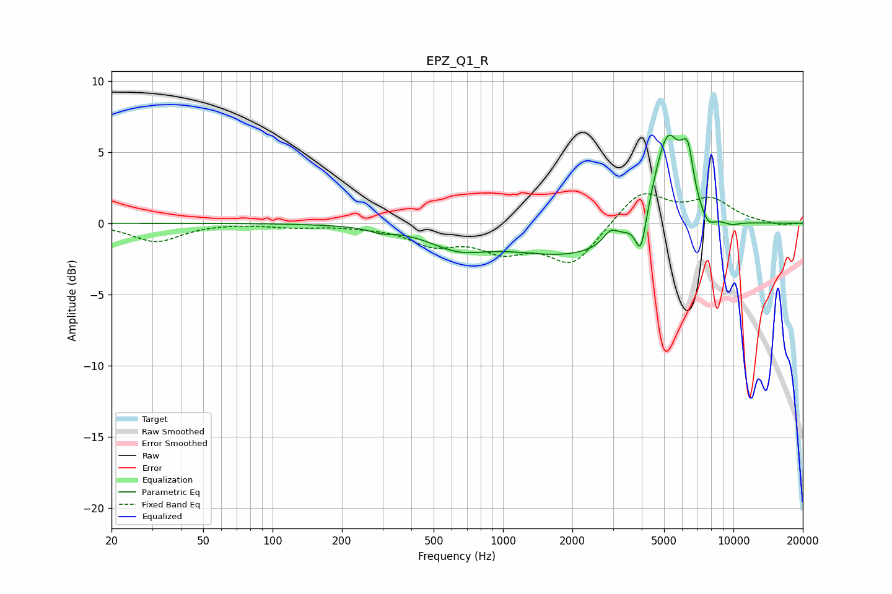

# EPZ_Q1_R
See [usage instructions](https://github.com/jaakkopasanen/AutoEq#usage) for more options and info.

### Parametric EQs
Apply preamp of -6.3 dB when using parametric equalizer.

|   # | Type    |   Fc (Hz) |    Q |   Gain (dB) |
|-----|---------|-----------|------|-------------|
|   1 | Peaking |       294 | 2.97 |        -0.3 |
|   2 | Peaking |       635 | 1.12 |        -1.2 |
|   3 | Peaking |      2044 | 0.48 |        -2.3 |
|   4 | Peaking |      2929 | 4.52 |         0.9 |
|   5 | Peaking |      3967 | 6    |        -2.9 |
|   6 | Peaking |      5180 | 2.17 |         7   |
|   7 | Peaking |      6046 | 6    |         0.8 |
|   8 | Peaking |      6375 | 5.99 |         2.7 |
|   9 | Peaking |      7734 | 4.2  |        -0.9 |
|  10 | Peaking |      9801 | 3.46 |        -0.3 |

### Fixed Band EQs
When using fixed band (also called graphic) equalizer, apply preamp of **-2.2 dB** (if available) and set gains manually with these parameters.

|   # | Type    |   Fc (Hz) |    Q |   Gain (dB) |
|-----|---------|-----------|------|-------------|
|   1 | Peaking |        31 | 1.41 |        -1.3 |
|   2 | Peaking |        62 | 1.41 |         0   |
|   3 | Peaking |       125 | 1.41 |        -0.2 |
|   4 | Peaking |       250 | 1.41 |        -0.1 |
|   5 | Peaking |       500 | 1.41 |        -1.3 |
|   6 | Peaking |      1000 | 1.41 |        -1.7 |
|   7 | Peaking |      2000 | 1.41 |        -2.8 |
|   8 | Peaking |      4000 | 1.41 |         2.3 |
|   9 | Peaking |      8000 | 1.41 |         1.6 |
|  10 | Peaking |     16000 | 1.41 |        -0.2 |

### Graphs

