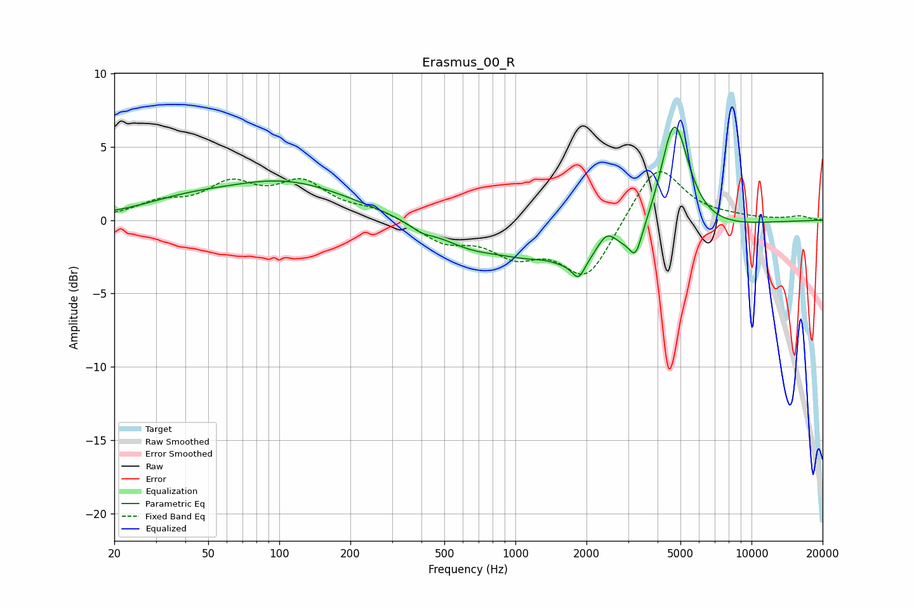

# Erasmus_00_R
See [usage instructions](https://github.com/jaakkopasanen/AutoEq#usage) for more options and info.

### Parametric EQs
Apply preamp of -6.4 dB when using parametric equalizer.

|   # | Type    |   Fc (Hz) |    Q |   Gain (dB) |
|-----|---------|-----------|------|-------------|
|   1 | Peaking |        39 | 0.77 |         0.8 |
|   2 | Peaking |       106 | 0.51 |         2.5 |
|   3 | Peaking |       400 | 2.84 |        -0.4 |
|   4 | Peaking |       628 | 1.16 |        -0.8 |
|   5 | Peaking |      1347 | 2.39 |         0.3 |
|   6 | Peaking |      1849 | 5.43 |        -1.2 |
|   7 | Peaking |      2073 | 0.4  |        -3.5 |
|   8 | Peaking |      2435 | 3.11 |         1.8 |
|   9 | Peaking |      3230 | 5.55 |        -1.6 |
|  10 | Peaking |      4705 | 2.21 |         8.5 |

### Fixed Band EQs
When using fixed band (also called graphic) equalizer, apply preamp of **-3.4 dB** (if available) and set gains manually with these parameters.

|   # | Type    |   Fc (Hz) |    Q |   Gain (dB) |
|-----|---------|-----------|------|-------------|
|   1 | Peaking |        31 | 1.41 |         1   |
|   2 | Peaking |        62 | 1.41 |         2.2 |
|   3 | Peaking |       125 | 1.41 |         2.3 |
|   4 | Peaking |       250 | 1.41 |         0.7 |
|   5 | Peaking |       500 | 1.41 |        -1.4 |
|   6 | Peaking |      1000 | 1.41 |        -2   |
|   7 | Peaking |      2000 | 1.41 |        -3.9 |
|   8 | Peaking |      4000 | 1.41 |         4   |
|   9 | Peaking |      8000 | 1.41 |         0.1 |
|  10 | Peaking |     16000 | 1.41 |         0.3 |

### Graphs

