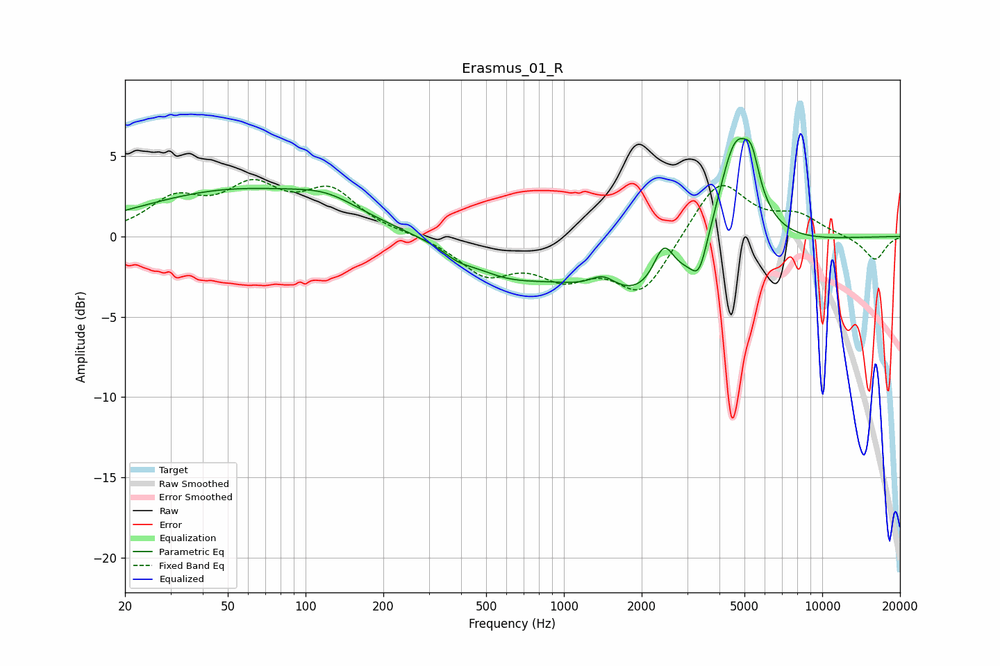

# Erasmus_01_R
See [usage instructions](https://github.com/jaakkopasanen/AutoEq#usage) for more options and info.

### Parametric EQs
Apply preamp of -6.2 dB when using parametric equalizer.

|   # | Type    |   Fc (Hz) |    Q |   Gain (dB) |
|-----|---------|-----------|------|-------------|
|   1 | Peaking |        54 | 0.37 |         2.8 |
|   2 | Peaking |       121 | 1.14 |         0.9 |
|   3 | Peaking |       389 | 2.65 |        -0.4 |
|   4 | Peaking |       587 | 0.86 |        -1.7 |
|   5 | Peaking |      1420 | 2.69 |         1   |
|   6 | Peaking |      2264 | 0.48 |        -4.3 |
|   7 | Peaking |      2436 | 3.46 |         2.6 |
|   8 | Peaking |      3339 | 4.6  |        -1.8 |
|   9 | Peaking |      4622 | 1.81 |         8.1 |
|  10 | Peaking |      5341 | 5.12 |         1.8 |

### Fixed Band EQs
When using fixed band (also called graphic) equalizer, apply preamp of **-3.6 dB** (if available) and set gains manually with these parameters.

|   # | Type    |   Fc (Hz) |    Q |   Gain (dB) |
|-----|---------|-----------|------|-------------|
|   1 | Peaking |        31 | 1.41 |         2.1 |
|   2 | Peaking |        62 | 1.41 |         2.7 |
|   3 | Peaking |       125 | 1.41 |         2.6 |
|   4 | Peaking |       250 | 1.41 |         0.1 |
|   5 | Peaking |       500 | 1.41 |        -2.2 |
|   6 | Peaking |      1000 | 1.41 |        -2.1 |
|   7 | Peaking |      2000 | 1.41 |        -3.5 |
|   8 | Peaking |      4000 | 1.41 |         3.7 |
|   9 | Peaking |      8000 | 1.41 |         1.2 |
|  10 | Peaking |     16000 | 1.41 |        -1.5 |

### Graphs

