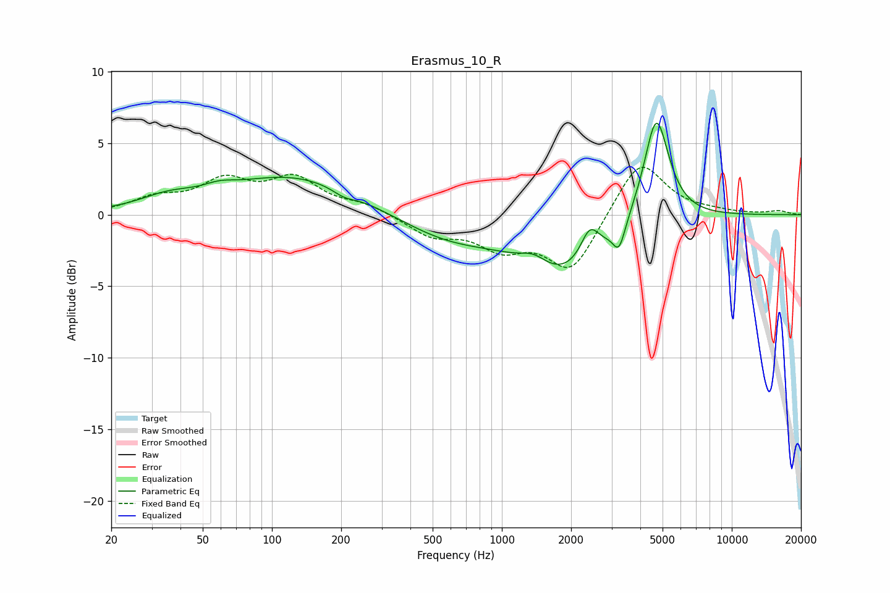

# Erasmus_10_R
See [usage instructions](https://github.com/jaakkopasanen/AutoEq#usage) for more options and info.

### Parametric EQs
Apply preamp of -6.5 dB when using parametric equalizer.

|   # | Type    |   Fc (Hz) |    Q |   Gain (dB) |
|-----|---------|-----------|------|-------------|
|   1 | Peaking |        35 | 1.15 |         0.8 |
|   2 | Peaking |        59 | 2.15 |         0.4 |
|   3 | Peaking |       126 | 0.47 |         2.7 |
|   4 | Peaking |       206 | 2.85 |        -0.4 |
|   5 | Peaking |       580 | 0.62 |        -1.7 |
|   6 | Peaking |      1383 | 2.37 |         0.8 |
|   7 | Peaking |      1852 | 0.76 |        -4   |
|   8 | Peaking |      2410 | 3.61 |         2   |
|   9 | Peaking |      3234 | 5.31 |        -1.8 |
|  10 | Peaking |      4695 | 2.56 |         7.5 |

### Fixed Band EQs
When using fixed band (also called graphic) equalizer, apply preamp of **-3.4 dB** (if available) and set gains manually with these parameters.

|   # | Type    |   Fc (Hz) |    Q |   Gain (dB) |
|-----|---------|-----------|------|-------------|
|   1 | Peaking |        31 | 1.41 |         1   |
|   2 | Peaking |        62 | 1.41 |         2.1 |
|   3 | Peaking |       125 | 1.41 |         2.3 |
|   4 | Peaking |       250 | 1.41 |         0.6 |
|   5 | Peaking |       500 | 1.41 |        -1.4 |
|   6 | Peaking |      1000 | 1.41 |        -2   |
|   7 | Peaking |      2000 | 1.41 |        -3.9 |
|   8 | Peaking |      4000 | 1.41 |         4   |
|   9 | Peaking |      8000 | 1.41 |         0.2 |
|  10 | Peaking |     16000 | 1.41 |         0.3 |

### Graphs

