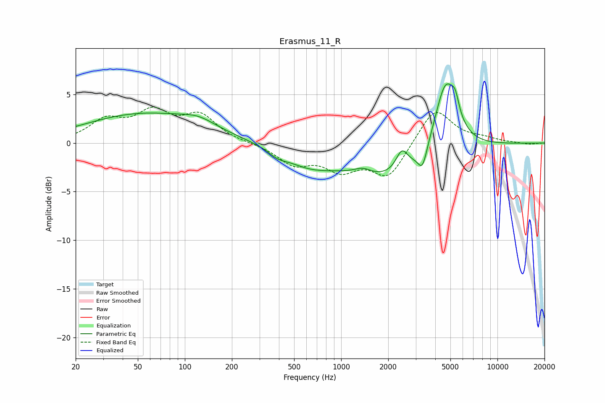

# Erasmus_11_R
See [usage instructions](https://github.com/jaakkopasanen/AutoEq#usage) for more options and info.

### Parametric EQs
Apply preamp of -6.2 dB when using parametric equalizer.

|   # | Type    |   Fc (Hz) |    Q |   Gain (dB) |
|-----|---------|-----------|------|-------------|
|   1 | Peaking |        55 | 0.37 |         3   |
|   2 | Peaking |       122 | 1.33 |         0.8 |
|   3 | Peaking |       392 | 2.55 |        -0.6 |
|   4 | Peaking |       613 | 0.86 |        -1.7 |
|   5 | Peaking |      1377 | 2.47 |         0.7 |
|   6 | Peaking |      2049 | 0.49 |        -3.6 |
|   7 | Peaking |      2446 | 3.76 |         2   |
|   8 | Peaking |      3315 | 4.83 |        -2.2 |
|   9 | Peaking |      4663 | 1.95 |         7.7 |
|  10 | Peaking |      5372 | 5.9  |         1.6 |

### Fixed Band EQs
When using fixed band (also called graphic) equalizer, apply preamp of **-3.8 dB** (if available) and set gains manually with these parameters.

|   # | Type    |   Fc (Hz) |    Q |   Gain (dB) |
|-----|---------|-----------|------|-------------|
|   1 | Peaking |        31 | 1.41 |         2.1 |
|   2 | Peaking |        62 | 1.41 |         2.8 |
|   3 | Peaking |       125 | 1.41 |         2.6 |
|   4 | Peaking |       250 | 1.41 |        -0   |
|   5 | Peaking |       500 | 1.41 |        -2   |
|   6 | Peaking |      1000 | 1.41 |        -2.4 |
|   7 | Peaking |      2000 | 1.41 |        -3.5 |
|   8 | Peaking |      4000 | 1.41 |         3.7 |
|   9 | Peaking |      8000 | 1.41 |         0.4 |
|  10 | Peaking |     16000 | 1.41 |        -0.2 |

### Graphs

