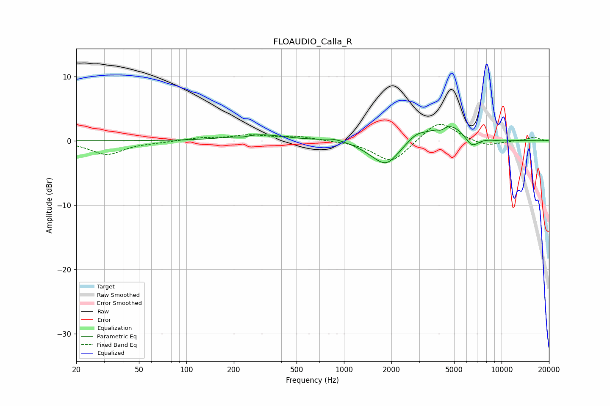

# FLOAUDIO_Calla_R
See [usage instructions](https://github.com/jaakkopasanen/AutoEq#usage) for more options and info.

### Parametric EQs
Apply preamp of -2.3 dB when using parametric equalizer.

|   # | Type    |   Fc (Hz) |    Q |   Gain (dB) |
|-----|---------|-----------|------|-------------|
|   1 | Peaking |       229 | 4.16 |        -0.3 |
|   2 | Peaking |       287 | 0.86 |         1   |
|   3 | Peaking |       862 | 2.12 |         0.5 |
|   4 | Peaking |      1529 | 1.57 |        -0.9 |
|   5 | Peaking |      1874 | 1.83 |        -3.3 |
|   6 | Peaking |      2893 | 2.57 |         1   |
|   7 | Peaking |      4147 | 6    |        -0.6 |
|   8 | Peaking |      4629 | 1.28 |         2.8 |
|   9 | Peaking |      6473 | 3.07 |        -1.9 |
|  10 | Peaking |      9969 | 2.33 |        -0.2 |

### Fixed Band EQs
When using fixed band (also called graphic) equalizer, apply preamp of **-2.7 dB** (if available) and set gains manually with these parameters.

|   # | Type    |   Fc (Hz) |    Q |   Gain (dB) |
|-----|---------|-----------|------|-------------|
|   1 | Peaking |        31 | 1.41 |        -2.1 |
|   2 | Peaking |        62 | 1.41 |        -0.2 |
|   3 | Peaking |       125 | 1.41 |         0.4 |
|   4 | Peaking |       250 | 1.41 |         0.8 |
|   5 | Peaking |       500 | 1.41 |         0.7 |
|   6 | Peaking |      1000 | 1.41 |        -0   |
|   7 | Peaking |      2000 | 1.41 |        -3.5 |
|   8 | Peaking |      4000 | 1.41 |         3.3 |
|   9 | Peaking |      8000 | 1.41 |        -0.9 |
|  10 | Peaking |     16000 | 1.41 |         0.5 |

### Graphs

