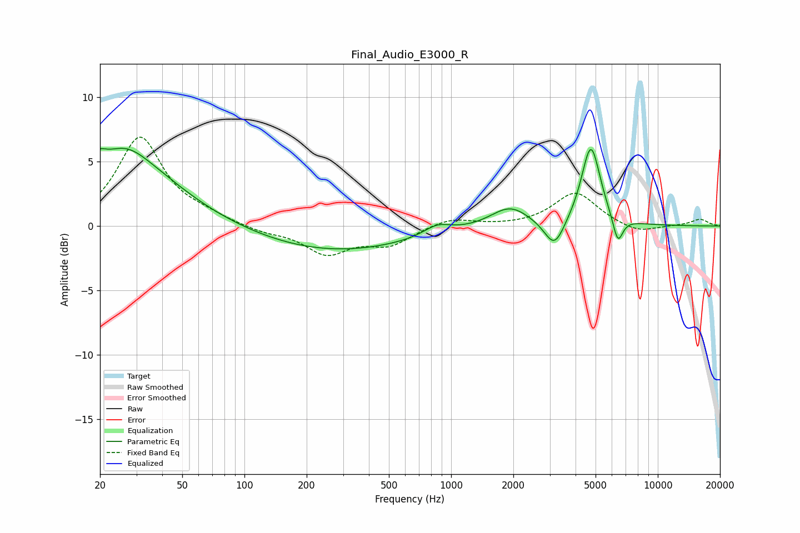

# Final_Audio_E3000_R
See [usage instructions](https://github.com/jaakkopasanen/AutoEq#usage) for more options and info.

### Parametric EQs
Apply preamp of -6.1 dB when using parametric equalizer.

|   # | Type    |   Fc (Hz) |    Q |   Gain (dB) |
|-----|---------|-----------|------|-------------|
|   1 | Peaking |        20 | 5.46 |         3.5 |
|   2 | Peaking |        20 | 5.91 |        -2.5 |
|   3 | Peaking |        26 | 1.44 |         1.2 |
|   4 | Peaking |        27 | 0.56 |         4.8 |
|   5 | Peaking |       269 | 0.37 |        -2   |
|   6 | Peaking |       857 | 2.15 |         0.8 |
|   7 | Peaking |      1924 | 1.51 |         1.6 |
|   8 | Peaking |      3164 | 2.91 |        -2.3 |
|   9 | Peaking |      4744 | 3.05 |         6.3 |
|  10 | Peaking |      6407 | 5.57 |        -2.1 |

### Fixed Band EQs
When using fixed band (also called graphic) equalizer, apply preamp of **-7.0 dB** (if available) and set gains manually with these parameters.

|   # | Type    |   Fc (Hz) |    Q |   Gain (dB) |
|-----|---------|-----------|------|-------------|
|   1 | Peaking |        31 | 1.41 |         6.8 |
|   2 | Peaking |        62 | 1.41 |         0.6 |
|   3 | Peaking |       125 | 1.41 |        -0.4 |
|   4 | Peaking |       250 | 1.41 |        -2.1 |
|   5 | Peaking |       500 | 1.41 |        -1.4 |
|   6 | Peaking |      1000 | 1.41 |         0.7 |
|   7 | Peaking |      2000 | 1.41 |        -0   |
|   8 | Peaking |      4000 | 1.41 |         2.6 |
|   9 | Peaking |      8000 | 1.41 |        -0.6 |
|  10 | Peaking |     16000 | 1.41 |         0.5 |

### Graphs

