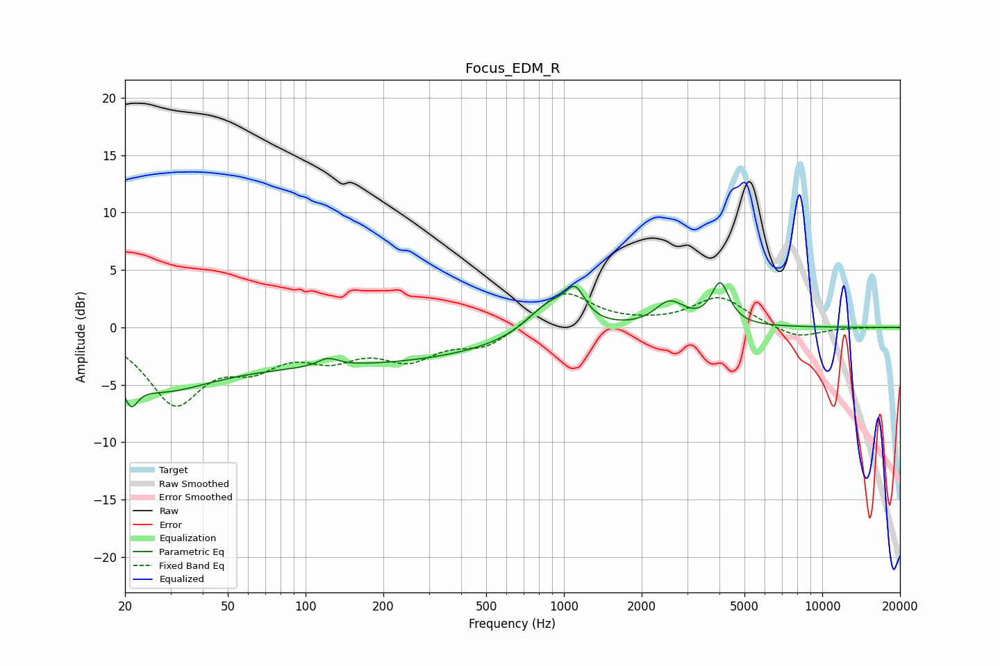

# Focus_EDM_R
See [usage instructions](https://github.com/jaakkopasanen/AutoEq#usage) for more options and info.

### Parametric EQs
Apply preamp of -4.0 dB when using parametric equalizer.

|   # | Type    |   Fc (Hz) |    Q |   Gain (dB) |
|-----|---------|-----------|------|-------------|
|   1 | Peaking |        21 | 5.47 |        -2.1 |
|   2 | Peaking |        26 | 0.73 |        -3.5 |
|   3 | Peaking |       121 | 0.18 |        -3.2 |
|   4 | Peaking |       122 | 3.57 |         0.7 |
|   5 | Peaking |       883 | 1.6  |         2.8 |
|   6 | Peaking |      1108 | 3.82 |         2.5 |
|   7 | Peaking |      2590 | 2.8  |         3.1 |
|   8 | Peaking |      2617 | 3.61 |        -1   |
|   9 | Peaking |      4028 | 4.07 |         3.6 |
|  10 | Peaking |      9086 | 5.77 |         0   |

### Fixed Band EQs
When using fixed band (also called graphic) equalizer, apply preamp of **-3.0 dB** (if available) and set gains manually with these parameters.

|   # | Type    |   Fc (Hz) |    Q |   Gain (dB) |
|-----|---------|-----------|------|-------------|
|   1 | Peaking |        31 | 1.41 |        -6.3 |
|   2 | Peaking |        62 | 1.41 |        -2.6 |
|   3 | Peaking |       125 | 1.41 |        -2.1 |
|   4 | Peaking |       250 | 1.41 |        -2.4 |
|   5 | Peaking |       500 | 1.41 |        -1.7 |
|   6 | Peaking |      1000 | 1.41 |         3.2 |
|   7 | Peaking |      2000 | 1.41 |         0.1 |
|   8 | Peaking |      4000 | 1.41 |         2.6 |
|   9 | Peaking |      8000 | 1.41 |        -1   |
|  10 | Peaking |     16000 | 1.41 |        -0   |

### Graphs

