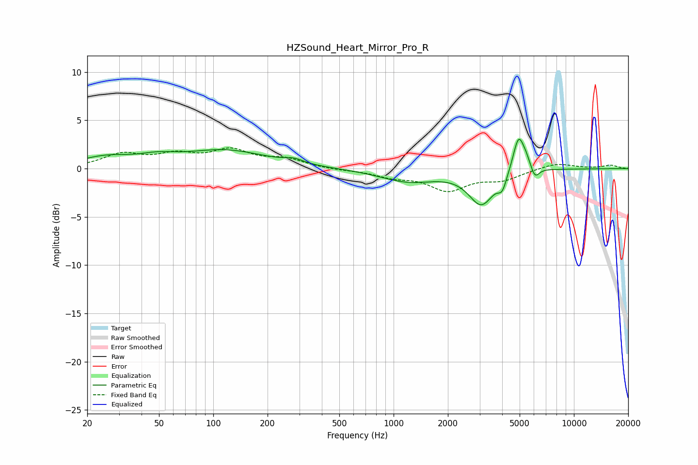

# HZSound_Heart_Mirror_Pro_R
See [usage instructions](https://github.com/jaakkopasanen/AutoEq#usage) for more options and info.

### Parametric EQs
Apply preamp of -3.1 dB when using parametric equalizer.

|   # | Type    |   Fc (Hz) |    Q |   Gain (dB) |
|-----|---------|-----------|------|-------------|
|   1 | Peaking |        25 | 0.99 |         1   |
|   2 | Peaking |        49 | 1.37 |         0.7 |
|   3 | Peaking |       116 | 0.61 |         1.8 |
|   4 | Peaking |       280 | 2.74 |         0.4 |
|   5 | Peaking |      1207 | 0.9  |        -1.3 |
|   6 | Peaking |      3069 | 2.02 |        -3.5 |
|   7 | Peaking |      4004 | 5.99 |        -1.4 |
|   8 | Peaking |      4935 | 4.5  |         3.8 |
|   9 | Peaking |      5443 | 5.99 |         0.7 |
|  10 | Peaking |      6082 | 6    |        -1.2 |

### Fixed Band EQs
When using fixed band (also called graphic) equalizer, apply preamp of **-2.2 dB** (if available) and set gains manually with these parameters.

|   # | Type    |   Fc (Hz) |    Q |   Gain (dB) |
|-----|---------|-----------|------|-------------|
|   1 | Peaking |        31 | 1.41 |         1.4 |
|   2 | Peaking |        62 | 1.41 |         1.2 |
|   3 | Peaking |       125 | 1.41 |         1.7 |
|   4 | Peaking |       250 | 1.41 |         0.9 |
|   5 | Peaking |       500 | 1.41 |        -0.1 |
|   6 | Peaking |      1000 | 1.41 |        -0.7 |
|   7 | Peaking |      2000 | 1.41 |        -2.1 |
|   8 | Peaking |      4000 | 1.41 |        -1   |
|   9 | Peaking |      8000 | 1.41 |         0.6 |
|  10 | Peaking |     16000 | 1.41 |         0.3 |

### Graphs

