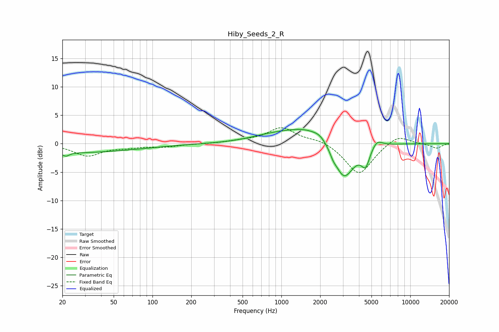

# Hiby_Seeds_2_R
See [usage instructions](https://github.com/jaakkopasanen/AutoEq#usage) for more options and info.

### Parametric EQs
Apply preamp of -2.6 dB when using parametric equalizer.

|   # | Type    |   Fc (Hz) |    Q |   Gain (dB) |
|-----|---------|-----------|------|-------------|
|   1 | Peaking |        20 | 0.22 |        -1.6 |
|   2 | Peaking |        21 | 5.98 |        -0.6 |
|   3 | Peaking |       801 | 0.9  |         0.6 |
|   4 | Peaking |      1768 | 0.64 |         3.3 |
|   5 | Peaking |      1978 | 3.86 |         0.4 |
|   6 | Peaking |      2517 | 5.94 |        -0.8 |
|   7 | Peaking |      3008 | 2.5  |        -1.7 |
|   8 | Peaking |      3079 | 1.51 |        -5.8 |
|   9 | Peaking |      4504 | 4.33 |        -3.1 |
|  10 | Peaking |      5507 | 3.36 |         1.4 |

### Fixed Band EQs
When using fixed band (also called graphic) equalizer, apply preamp of **-2.9 dB** (if available) and set gains manually with these parameters.

|   # | Type    |   Fc (Hz) |    Q |   Gain (dB) |
|-----|---------|-----------|------|-------------|
|   1 | Peaking |        31 | 1.41 |        -2.1 |
|   2 | Peaking |        62 | 1.41 |        -0.5 |
|   3 | Peaking |       125 | 1.41 |        -0.5 |
|   4 | Peaking |       250 | 1.41 |        -0   |
|   5 | Peaking |       500 | 1.41 |         0.4 |
|   6 | Peaking |      1000 | 1.41 |         2.8 |
|   7 | Peaking |      2000 | 1.41 |         0.8 |
|   8 | Peaking |      4000 | 1.41 |        -5.5 |
|   9 | Peaking |      8000 | 1.41 |         1.7 |
|  10 | Peaking |     16000 | 1.41 |        -0.8 |

### Graphs

