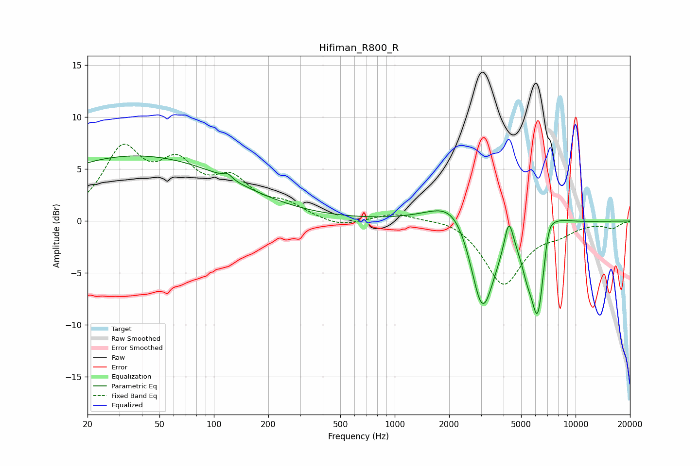

# Hifiman_R800_R
See [usage instructions](https://github.com/jaakkopasanen/AutoEq#usage) for more options and info.

### Parametric EQs
Apply preamp of -6.4 dB when using parametric equalizer.

|   # | Type    |   Fc (Hz) |    Q |   Gain (dB) |
|-----|---------|-----------|------|-------------|
|   1 | Peaking |        37 | 0.25 |         6.3 |
|   2 | Peaking |       119 | 6    |         0.5 |
|   3 | Peaking |      2208 | 1.11 |         3.5 |
|   4 | Peaking |      3048 | 1.95 |       -10.1 |
|   5 | Peaking |      4276 | 5.76 |         3.3 |
|   6 | Peaking |      5379 | 4.52 |        -1.9 |
|   7 | Peaking |      6163 | 5.69 |        -1.3 |
|   8 | Peaking |      6200 | 3.12 |        -8.3 |
|   9 | Peaking |      7066 | 4.54 |         2.1 |
|  10 | Peaking |      7384 | 1.67 |         1.7 |

### Fixed Band EQs
When using fixed band (also called graphic) equalizer, apply preamp of **-7.5 dB** (if available) and set gains manually with these parameters.

|   # | Type    |   Fc (Hz) |    Q |   Gain (dB) |
|-----|---------|-----------|------|-------------|
|   1 | Peaking |        31 | 1.41 |         6.4 |
|   2 | Peaking |        62 | 1.41 |         4.5 |
|   3 | Peaking |       125 | 1.41 |         3.3 |
|   4 | Peaking |       250 | 1.41 |         1.3 |
|   5 | Peaking |       500 | 1.41 |        -0.7 |
|   6 | Peaking |      1000 | 1.41 |         0.8 |
|   7 | Peaking |      2000 | 1.41 |         0.4 |
|   8 | Peaking |      4000 | 1.41 |        -6   |
|   9 | Peaking |      8000 | 1.41 |        -0.9 |
|  10 | Peaking |     16000 | 1.41 |        -0.6 |

### Graphs

