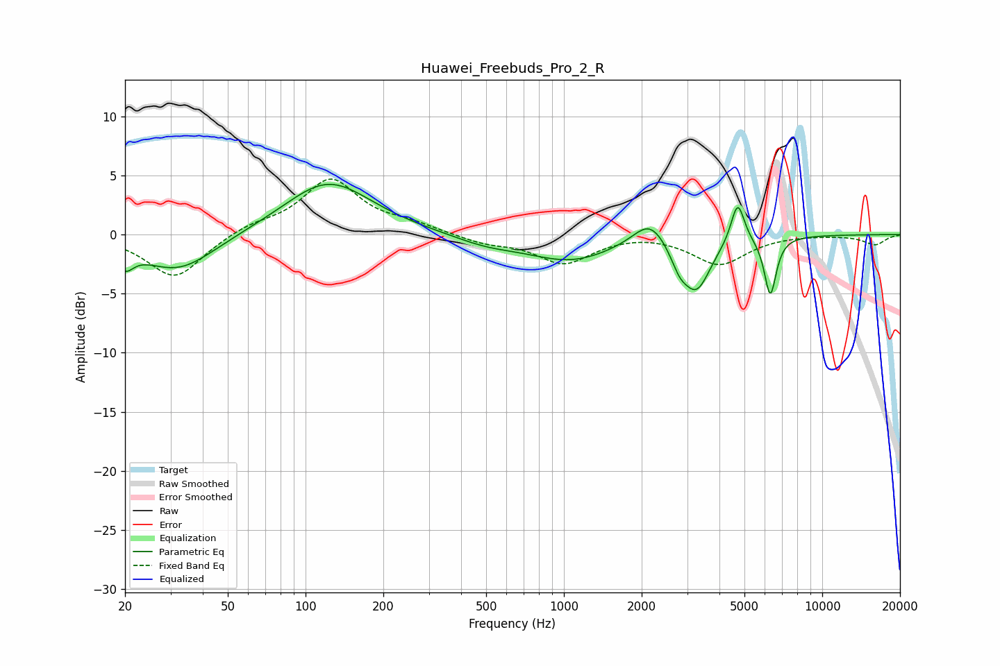

# Huawei_Freebuds_Pro_2_R
See [usage instructions](https://github.com/jaakkopasanen/AutoEq#usage) for more options and info.

### Parametric EQs
Apply preamp of -4.3 dB when using parametric equalizer.

|   # | Type    |   Fc (Hz) |    Q |   Gain (dB) |
|-----|---------|-----------|------|-------------|
|   1 | Peaking |        20 | 4.37 |        -1.6 |
|   2 | Peaking |        32 | 0.98 |        -3.2 |
|   3 | Peaking |       122 | 0.84 |         4.6 |
|   4 | Peaking |       499 | 1.12 |        -0.7 |
|   5 | Peaking |      1061 | 0.84 |        -2.1 |
|   6 | Peaking |      2154 | 2.19 |         2.2 |
|   7 | Peaking |      2797 | 4.08 |        -1.5 |
|   8 | Peaking |      3265 | 2.57 |        -4.3 |
|   9 | Peaking |      4706 | 5.4  |         3.6 |
|  10 | Peaking |      6294 | 5.99 |        -5   |

### Fixed Band EQs
When using fixed band (also called graphic) equalizer, apply preamp of **-4.8 dB** (if available) and set gains manually with these parameters.

|   # | Type    |   Fc (Hz) |    Q |   Gain (dB) |
|-----|---------|-----------|------|-------------|
|   1 | Peaking |        31 | 1.41 |        -3.7 |
|   2 | Peaking |        62 | 1.41 |         0.8 |
|   3 | Peaking |       125 | 1.41 |         4.6 |
|   4 | Peaking |       250 | 1.41 |         0.7 |
|   5 | Peaking |       500 | 1.41 |        -0.7 |
|   6 | Peaking |      1000 | 1.41 |        -2.4 |
|   7 | Peaking |      2000 | 1.41 |         0.2 |
|   8 | Peaking |      4000 | 1.41 |        -2.5 |
|   9 | Peaking |      8000 | 1.41 |         0   |
|  10 | Peaking |     16000 | 1.41 |        -0.9 |

### Graphs

