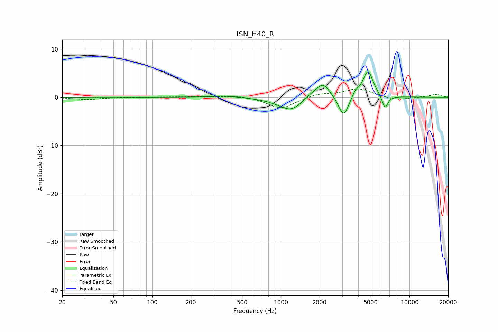

# ISN_H40_R
See [usage instructions](https://github.com/jaakkopasanen/AutoEq#usage) for more options and info.

### Parametric EQs
Apply preamp of -5.3 dB when using parametric equalizer.

|   # | Type    |   Fc (Hz) |    Q |   Gain (dB) |
|-----|---------|-----------|------|-------------|
|   1 | Peaking |       374 | 1.42 |         0.3 |
|   2 | Peaking |      1008 | 1.11 |        -0.5 |
|   3 | Peaking |      1212 | 1.65 |        -2.4 |
|   4 | Peaking |      1777 | 2.06 |         0.6 |
|   5 | Peaking |      1792 | 1.93 |         0.5 |
|   6 | Peaking |      2144 | 2.74 |         2.7 |
|   7 | Peaking |      3076 | 3.66 |        -4.4 |
|   8 | Peaking |      3808 | 5.92 |         1.1 |
|   9 | Peaking |      4760 | 3.47 |         5.6 |
|  10 | Peaking |      6454 | 5.91 |        -2.8 |

### Fixed Band EQs
When using fixed band (also called graphic) equalizer, apply preamp of **-1.8 dB** (if available) and set gains manually with these parameters.

|   # | Type    |   Fc (Hz) |    Q |   Gain (dB) |
|-----|---------|-----------|------|-------------|
|   1 | Peaking |        31 | 1.41 |        -0.5 |
|   2 | Peaking |        62 | 1.41 |         0   |
|   3 | Peaking |       125 | 1.41 |         0   |
|   4 | Peaking |       250 | 1.41 |         0.1 |
|   5 | Peaking |       500 | 1.41 |         0.4 |
|   6 | Peaking |      1000 | 1.41 |        -2.4 |
|   7 | Peaking |      2000 | 1.41 |         0.7 |
|   8 | Peaking |      4000 | 1.41 |         1.7 |
|   9 | Peaking |      8000 | 1.41 |        -0.7 |
|  10 | Peaking |     16000 | 1.41 |         0.6 |

### Graphs

