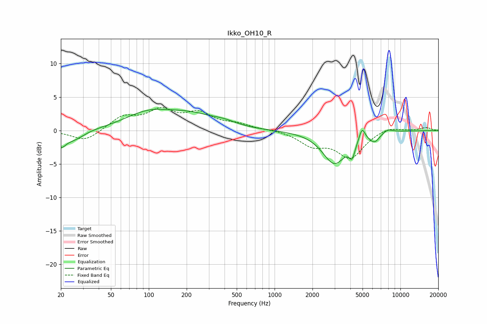

# Ikko_OH10_R
See [usage instructions](https://github.com/jaakkopasanen/AutoEq#usage) for more options and info.

### Parametric EQs
Apply preamp of -3.3 dB when using parametric equalizer.

|   # | Type    |   Fc (Hz) |    Q |   Gain (dB) |
|-----|---------|-----------|------|-------------|
|   1 | Peaking |        20 | 3.68 |        -1.9 |
|   2 | Peaking |        25 | 1.65 |        -1.4 |
|   3 | Peaking |        99 | 0.76 |         2.4 |
|   4 | Peaking |       215 | 0.75 |         1.8 |
|   5 | Peaking |       395 | 1.37 |         0.6 |
|   6 | Peaking |      2988 | 1.5  |        -4.9 |
|   7 | Peaking |      4133 | 6    |        -2.1 |
|   8 | Peaking |      4958 | 6    |         1.9 |
|   9 | Peaking |      6232 | 3.32 |        -1.3 |
|  10 | Peaking |      7906 | 3.08 |         0.6 |

### Fixed Band EQs
When using fixed band (also called graphic) equalizer, apply preamp of **-3.5 dB** (if available) and set gains manually with these parameters.

|   # | Type    |   Fc (Hz) |    Q |   Gain (dB) |
|-----|---------|-----------|------|-------------|
|   1 | Peaking |        31 | 1.41 |        -1.7 |
|   2 | Peaking |        62 | 1.41 |         2   |
|   3 | Peaking |       125 | 1.41 |         2.7 |
|   4 | Peaking |       250 | 1.41 |         2.3 |
|   5 | Peaking |       500 | 1.41 |         0.8 |
|   6 | Peaking |      1000 | 1.41 |         0.1 |
|   7 | Peaking |      2000 | 1.41 |        -2   |
|   8 | Peaking |      4000 | 1.41 |        -3.9 |
|   9 | Peaking |      8000 | 1.41 |         0.7 |
|  10 | Peaking |     16000 | 1.41 |         0.5 |

### Graphs

