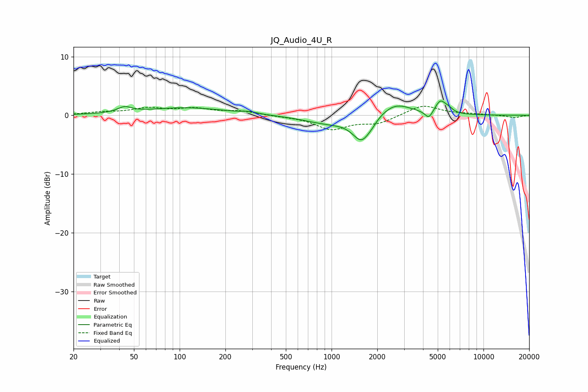

# JQ_Audio_4U_R
See [usage instructions](https://github.com/jaakkopasanen/AutoEq#usage) for more options and info.

### Parametric EQs
Apply preamp of -2.5 dB when using parametric equalizer.

|   # | Type    |   Fc (Hz) |    Q |   Gain (dB) |
|-----|---------|-----------|------|-------------|
|   1 | Peaking |        43 | 3.1  |         0.9 |
|   2 | Peaking |       111 | 0.54 |         1.3 |
|   3 | Peaking |       288 | 3.14 |         0.3 |
|   4 | Peaking |       942 | 0.89 |        -1.3 |
|   5 | Peaking |      1583 | 2.35 |        -4.2 |
|   6 | Peaking |      1852 | 5.11 |        -0.3 |
|   7 | Peaking |      2618 | 1.36 |         2.3 |
|   8 | Peaking |      4369 | 5.5  |        -1.4 |
|   9 | Peaking |      5209 | 3.98 |         2.2 |
|  10 | Peaking |      5913 | 5.36 |         0.6 |

### Fixed Band EQs
When using fixed band (also called graphic) equalizer, apply preamp of **-1.6 dB** (if available) and set gains manually with these parameters.

|   # | Type    |   Fc (Hz) |    Q |   Gain (dB) |
|-----|---------|-----------|------|-------------|
|   1 | Peaking |        31 | 1.41 |         0.4 |
|   2 | Peaking |        62 | 1.41 |         1.1 |
|   3 | Peaking |       125 | 1.41 |         1   |
|   4 | Peaking |       250 | 1.41 |         0.7 |
|   5 | Peaking |       500 | 1.41 |        -0.1 |
|   6 | Peaking |      1000 | 1.41 |        -2.3 |
|   7 | Peaking |      2000 | 1.41 |        -1.3 |
|   8 | Peaking |      4000 | 1.41 |         1.8 |
|   9 | Peaking |      8000 | 1.41 |         0.2 |
|  10 | Peaking |     16000 | 1.41 |        -0.4 |

### Graphs

