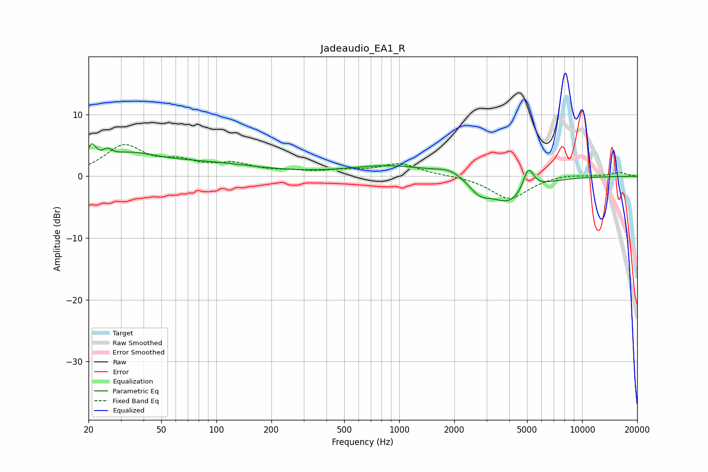

# Jadeaudio_EA1_R
See [usage instructions](https://github.com/jaakkopasanen/AutoEq#usage) for more options and info.

### Parametric EQs
Apply preamp of -5.3 dB when using parametric equalizer.

|   # | Type    |   Fc (Hz) |    Q |   Gain (dB) |
|-----|---------|-----------|------|-------------|
|   1 | Peaking |        21 | 5.97 |         3   |
|   2 | Peaking |        25 | 5.5  |         1.2 |
|   3 | Peaking |        33 | 0.89 |         2.9 |
|   4 | Peaking |        87 | 0.49 |         1.8 |
|   5 | Peaking |       220 | 1.2  |         0   |
|   6 | Peaking |       890 | 0.62 |         1.7 |
|   7 | Peaking |      1897 | 1.92 |         1.1 |
|   8 | Peaking |      2745 | 2.42 |        -2.1 |
|   9 | Peaking |      4031 | 1.33 |        -4.3 |
|  10 | Peaking |      5078 | 4.75 |         3.9 |

### Fixed Band EQs
When using fixed band (also called graphic) equalizer, apply preamp of **-5.2 dB** (if available) and set gains manually with these parameters.

|   # | Type    |   Fc (Hz) |    Q |   Gain (dB) |
|-----|---------|-----------|------|-------------|
|   1 | Peaking |        31 | 1.41 |         4.7 |
|   2 | Peaking |        62 | 1.41 |         1.9 |
|   3 | Peaking |       125 | 1.41 |         1.7 |
|   4 | Peaking |       250 | 1.41 |         0.5 |
|   5 | Peaking |       500 | 1.41 |         0.7 |
|   6 | Peaking |      1000 | 1.41 |         1.9 |
|   7 | Peaking |      2000 | 1.41 |         0.1 |
|   8 | Peaking |      4000 | 1.41 |        -3.7 |
|   9 | Peaking |      8000 | 1.41 |         0.4 |
|  10 | Peaking |     16000 | 1.41 |         0.6 |

### Graphs

