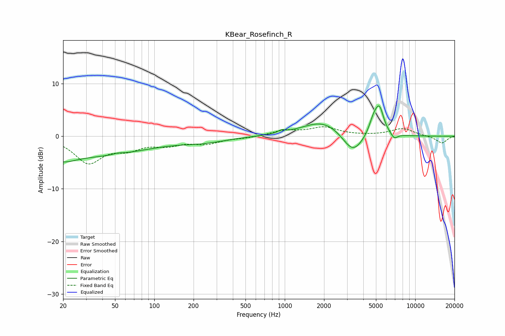

# KBear_Rosefinch_R
See [usage instructions](https://github.com/jaakkopasanen/AutoEq#usage) for more options and info.

### Parametric EQs
Apply preamp of -5.9 dB when using parametric equalizer.

|   # | Type    |   Fc (Hz) |    Q |   Gain (dB) |
|-----|---------|-----------|------|-------------|
|   1 | Peaking |        20 | 1.61 |        -1.4 |
|   2 | Peaking |        29 | 0.29 |        -3.7 |
|   3 | Peaking |        53 | 4.7  |         0.2 |
|   4 | Peaking |       241 | 0.8  |        -0.9 |
|   5 | Peaking |       946 | 5.55 |         0.5 |
|   6 | Peaking |      1982 | 0.89 |         3   |
|   7 | Peaking |      3324 | 1.75 |        -4.2 |
|   8 | Peaking |      4804 | 3.82 |         2.8 |
|   9 | Peaking |      5330 | 4.16 |         4.6 |
|  10 | Peaking |      6906 | 5.3  |        -1   |

### Fixed Band EQs
When using fixed band (also called graphic) equalizer, apply preamp of **-1.9 dB** (if available) and set gains manually with these parameters.

|   # | Type    |   Fc (Hz) |    Q |   Gain (dB) |
|-----|---------|-----------|------|-------------|
|   1 | Peaking |        31 | 1.41 |        -4.9 |
|   2 | Peaking |        62 | 1.41 |        -2   |
|   3 | Peaking |       125 | 1.41 |        -1.4 |
|   4 | Peaking |       250 | 1.41 |        -1.2 |
|   5 | Peaking |       500 | 1.41 |        -0.3 |
|   6 | Peaking |      1000 | 1.41 |         1   |
|   7 | Peaking |      2000 | 1.41 |         1.6 |
|   8 | Peaking |      4000 | 1.41 |         0.1 |
|   9 | Peaking |      8000 | 1.41 |         1.4 |
|  10 | Peaking |     16000 | 1.41 |        -1.3 |

### Graphs

