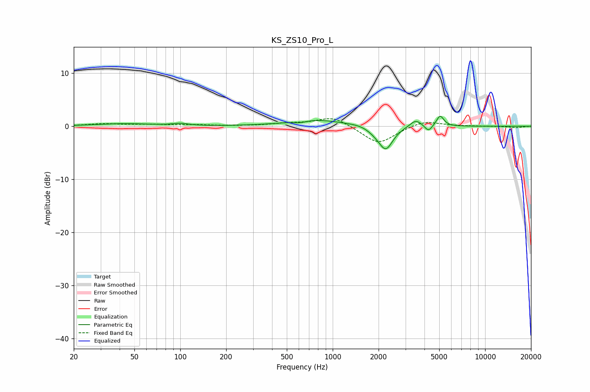

# KS_ZS10_Pro_L
See [usage instructions](https://github.com/jaakkopasanen/AutoEq#usage) for more options and info.

### Parametric EQs
Apply preamp of -2.0 dB when using parametric equalizer.

|   # | Type    |   Fc (Hz) |    Q |   Gain (dB) |
|-----|---------|-----------|------|-------------|
|   1 | Peaking |        43 | 0.8  |         0.5 |
|   2 | Peaking |       100 | 2.82 |         0.4 |
|   3 | Peaking |       613 | 3.45 |        -0.4 |
|   4 | Peaking |       774 | 0.8  |         1.2 |
|   5 | Peaking |      1547 | 2.06 |         0.3 |
|   6 | Peaking |      1902 | 2.49 |        -0.7 |
|   7 | Peaking |      2232 | 3.04 |        -4.2 |
|   8 | Peaking |      3507 | 3.66 |         1.4 |
|   9 | Peaking |      4251 | 5.99 |        -1.2 |
|  10 | Peaking |      5071 | 5.9  |         2   |

### Fixed Band EQs
When using fixed band (also called graphic) equalizer, apply preamp of **-1.5 dB** (if available) and set gains manually with these parameters.

|   # | Type    |   Fc (Hz) |    Q |   Gain (dB) |
|-----|---------|-----------|------|-------------|
|   1 | Peaking |        31 | 1.41 |         0.4 |
|   2 | Peaking |        62 | 1.41 |         0.3 |
|   3 | Peaking |       125 | 1.41 |         0.2 |
|   4 | Peaking |       250 | 1.41 |         0   |
|   5 | Peaking |       500 | 1.41 |         0.4 |
|   6 | Peaking |      1000 | 1.41 |         1.9 |
|   7 | Peaking |      2000 | 1.41 |        -3.4 |
|   8 | Peaking |      4000 | 1.41 |         1.2 |
|   9 | Peaking |      8000 | 1.41 |         0   |
|  10 | Peaking |     16000 | 1.41 |        -0.3 |

### Graphs

