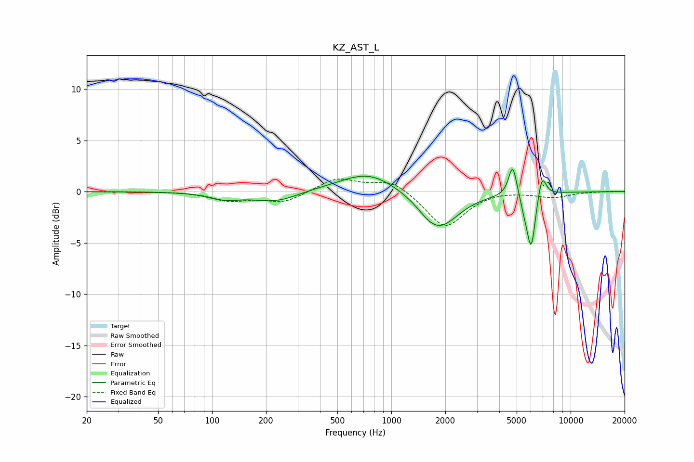

# KZ_AST_L
See [usage instructions](https://github.com/jaakkopasanen/AutoEq#usage) for more options and info.

### Parametric EQs
Apply preamp of -2.3 dB when using parametric equalizer.

|   # | Type    |   Fc (Hz) |    Q |   Gain (dB) |
|-----|---------|-----------|------|-------------|
|   1 | Peaking |       118 | 1.83 |        -0.6 |
|   2 | Peaking |       237 | 0.97 |        -1.4 |
|   3 | Peaking |       299 | 0.91 |         0.5 |
|   4 | Peaking |       746 | 0.9  |         2   |
|   5 | Peaking |      1629 | 2.29 |        -0.5 |
|   6 | Peaking |      1871 | 1.31 |        -3.4 |
|   7 | Peaking |      4757 | 6    |         3.2 |
|   8 | Peaking |      5613 | 4.64 |        -1.3 |
|   9 | Peaking |      6036 | 5.97 |        -4.9 |
|  10 | Peaking |      6926 | 5.97 |         2.3 |

### Fixed Band EQs
When using fixed band (also called graphic) equalizer, apply preamp of **-1.3 dB** (if available) and set gains manually with these parameters.

|   # | Type    |   Fc (Hz) |    Q |   Gain (dB) |
|-----|---------|-----------|------|-------------|
|   1 | Peaking |        31 | 1.41 |         0   |
|   2 | Peaking |        62 | 1.41 |         0   |
|   3 | Peaking |       125 | 1.41 |        -0.8 |
|   4 | Peaking |       250 | 1.41 |        -1   |
|   5 | Peaking |       500 | 1.41 |         1.3 |
|   6 | Peaking |      1000 | 1.41 |         1.2 |
|   7 | Peaking |      2000 | 1.41 |        -3.6 |
|   8 | Peaking |      4000 | 1.41 |         0.2 |
|   9 | Peaking |      8000 | 1.41 |        -0.5 |
|  10 | Peaking |     16000 | 1.41 |         0   |

### Graphs

