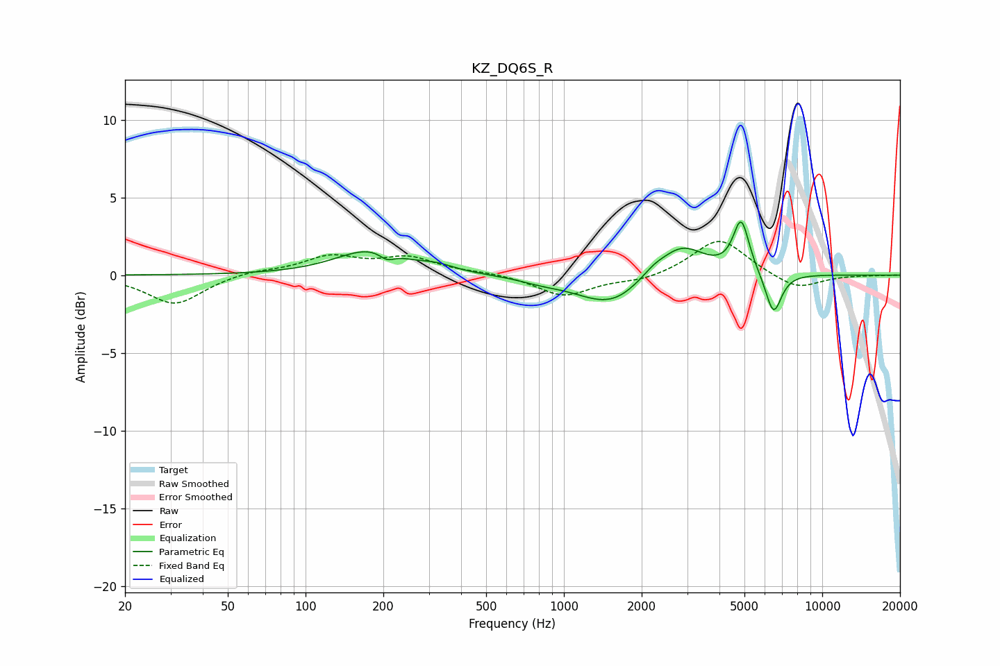

# KZ_DQ6S_R
See [usage instructions](https://github.com/jaakkopasanen/AutoEq#usage) for more options and info.

### Parametric EQs
Apply preamp of -3.5 dB when using parametric equalizer.

|   # | Type    |   Fc (Hz) |    Q |   Gain (dB) |
|-----|---------|-----------|------|-------------|
|   1 | Peaking |       178 | 1.07 |         1.6 |
|   2 | Peaking |       207 | 4.96 |        -0.5 |
|   3 | Peaking |       324 | 2.13 |         0.3 |
|   4 | Peaking |       826 | 1.63 |        -0.3 |
|   5 | Peaking |      1414 | 1.17 |        -1.6 |
|   6 | Peaking |      1662 | 1.96 |        -0.4 |
|   7 | Peaking |      2238 | 3.51 |         0.3 |
|   8 | Peaking |      2856 | 1.57 |         2   |
|   9 | Peaking |      4857 | 4.51 |         3.4 |
|  10 | Peaking |      6478 | 4.38 |        -2.7 |

### Fixed Band EQs
When using fixed band (also called graphic) equalizer, apply preamp of **-2.3 dB** (if available) and set gains manually with these parameters.

|   # | Type    |   Fc (Hz) |    Q |   Gain (dB) |
|-----|---------|-----------|------|-------------|
|   1 | Peaking |        31 | 1.41 |        -1.9 |
|   2 | Peaking |        62 | 1.41 |         0.3 |
|   3 | Peaking |       125 | 1.41 |         1.1 |
|   4 | Peaking |       250 | 1.41 |         1   |
|   5 | Peaking |       500 | 1.41 |         0.1 |
|   6 | Peaking |      1000 | 1.41 |        -1.4 |
|   7 | Peaking |      2000 | 1.41 |        -0.4 |
|   8 | Peaking |      4000 | 1.41 |         2.4 |
|   9 | Peaking |      8000 | 1.41 |        -1   |
|  10 | Peaking |     16000 | 1.41 |        -0   |

### Graphs

