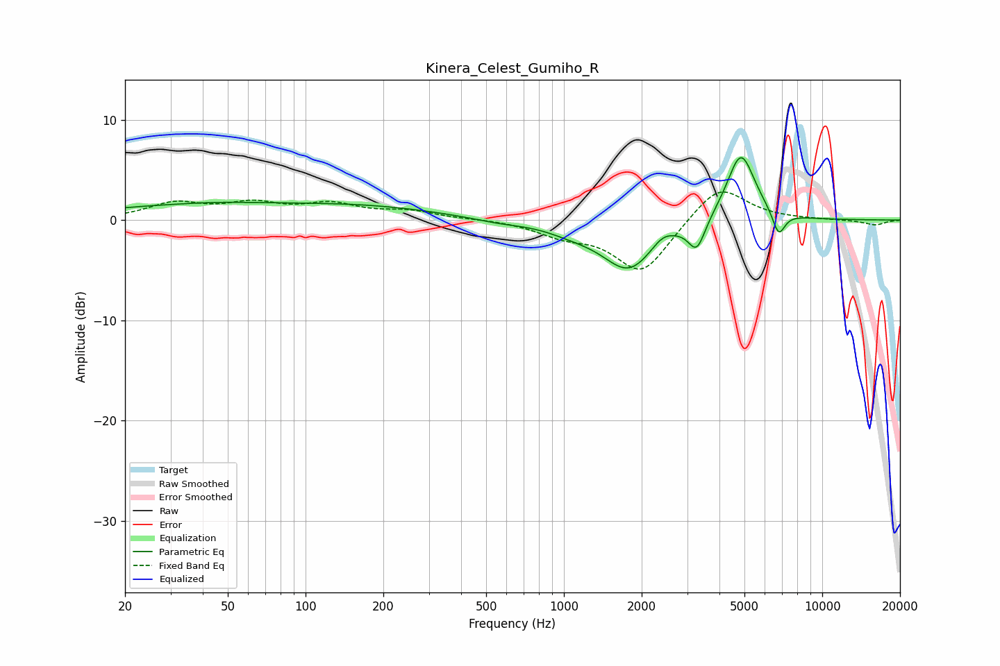

# Kinera_Celest_Gumiho_R
See [usage instructions](https://github.com/jaakkopasanen/AutoEq#usage) for more options and info.

### Parametric EQs
Apply preamp of -6.3 dB when using parametric equalizer.

|   # | Type    |   Fc (Hz) |    Q |   Gain (dB) |
|-----|---------|-----------|------|-------------|
|   1 | Peaking |        30 | 0.99 |        -0.2 |
|   2 | Peaking |        34 | 0.45 |         1.6 |
|   3 | Peaking |       163 | 0.45 |         1.3 |
|   4 | Peaking |       554 | 1.39 |        -0.4 |
|   5 | Peaking |      1075 | 1.39 |        -0.7 |
|   6 | Peaking |      1787 | 1.37 |        -4.9 |
|   7 | Peaking |      2408 | 3.17 |         1   |
|   8 | Peaking |      3270 | 4.36 |        -2.9 |
|   9 | Peaking |      4841 | 2.51 |         6.9 |
|  10 | Peaking |      6780 | 5.58 |        -2.5 |

### Fixed Band EQs
When using fixed band (also called graphic) equalizer, apply preamp of **-2.9 dB** (if available) and set gains manually with these parameters.

|   # | Type    |   Fc (Hz) |    Q |   Gain (dB) |
|-----|---------|-----------|------|-------------|
|   1 | Peaking |        31 | 1.41 |         1.6 |
|   2 | Peaking |        62 | 1.41 |         1.4 |
|   3 | Peaking |       125 | 1.41 |         1.4 |
|   4 | Peaking |       250 | 1.41 |         0.8 |
|   5 | Peaking |       500 | 1.41 |         0.1 |
|   6 | Peaking |      1000 | 1.41 |        -1.3 |
|   7 | Peaking |      2000 | 1.41 |        -5.3 |
|   8 | Peaking |      4000 | 1.41 |         3.7 |
|   9 | Peaking |      8000 | 1.41 |         0   |
|  10 | Peaking |     16000 | 1.41 |        -0.5 |

### Graphs

