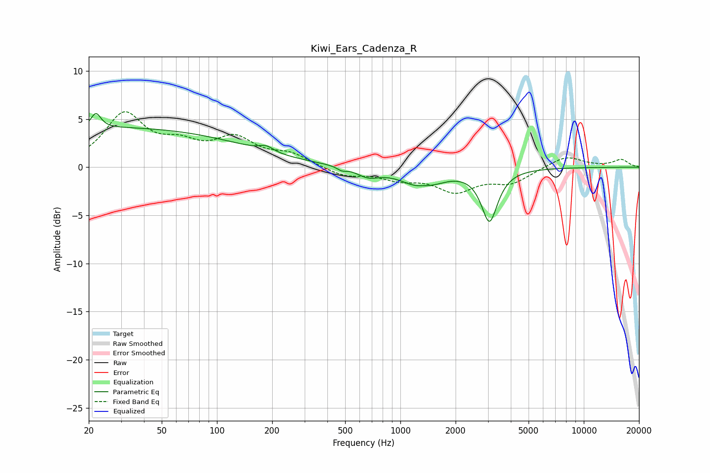

# Kiwi_Ears_Cadenza_R
See [usage instructions](https://github.com/jaakkopasanen/AutoEq#usage) for more options and info.

### Parametric EQs
Apply preamp of -5.7 dB when using parametric equalizer.

|   # | Type    |   Fc (Hz) |    Q |   Gain (dB) |
|-----|---------|-----------|------|-------------|
|   1 | Peaking |        22 | 5.45 |         1.5 |
|   2 | Peaking |        28 | 0.18 |         4.1 |
|   3 | Peaking |       186 | 3.69 |         0.6 |
|   4 | Peaking |       479 | 5.98 |        -0.3 |
|   5 | Peaking |       666 | 2.31 |        -0.9 |
|   6 | Peaking |      1322 | 1.4  |        -2.2 |
|   7 | Peaking |      1328 | 3.06 |         0.4 |
|   8 | Peaking |      1418 | 2.59 |         0.1 |
|   9 | Peaking |      3046 | 3.65 |         1.7 |
|  10 | Peaking |      3056 | 3.31 |        -7   |

### Fixed Band EQs
When using fixed band (also called graphic) equalizer, apply preamp of **-5.9 dB** (if available) and set gains manually with these parameters.

|   # | Type    |   Fc (Hz) |    Q |   Gain (dB) |
|-----|---------|-----------|------|-------------|
|   1 | Peaking |        31 | 1.41 |         5.3 |
|   2 | Peaking |        62 | 1.41 |         1.8 |
|   3 | Peaking |       125 | 1.41 |         2.7 |
|   4 | Peaking |       250 | 1.41 |         1.2 |
|   5 | Peaking |       500 | 1.41 |        -0.9 |
|   6 | Peaking |      1000 | 1.41 |        -1.1 |
|   7 | Peaking |      2000 | 1.41 |        -2.3 |
|   8 | Peaking |      4000 | 1.41 |        -1.5 |
|   9 | Peaking |      8000 | 1.41 |         1.2 |
|  10 | Peaking |     16000 | 1.41 |         0.8 |

### Graphs

