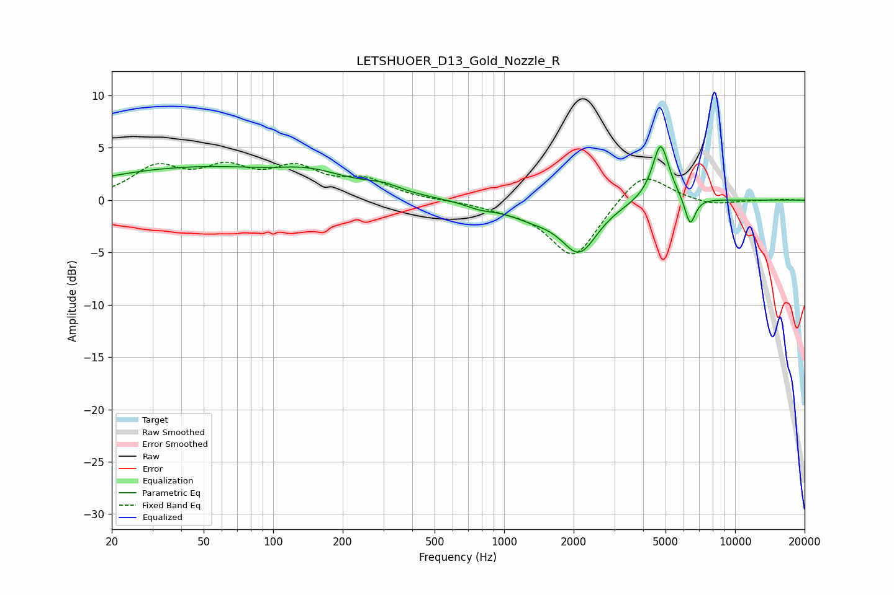

# LETSHUOER_D13_Gold_Nozzle_R
See [usage instructions](https://github.com/jaakkopasanen/AutoEq#usage) for more options and info.

### Parametric EQs
Apply preamp of -5.2 dB when using parametric equalizer.

|   # | Type    |   Fc (Hz) |    Q |   Gain (dB) |
|-----|---------|-----------|------|-------------|
|   1 | Peaking |        45 | 0.31 |         3   |
|   2 | Peaking |       101 | 1.04 |        -0.4 |
|   3 | Peaking |       141 | 0.8  |         1.6 |
|   4 | Peaking |       299 | 1.8  |         0.7 |
|   5 | Peaking |       786 | 2.15 |        -0.5 |
|   6 | Peaking |      1324 | 1.21 |        -1.2 |
|   7 | Peaking |      2119 | 1.81 |        -4.6 |
|   8 | Peaking |      4759 | 4.29 |         4.4 |
|   9 | Peaking |      4795 | 2.23 |         1.3 |
|  10 | Peaking |      6385 | 5.87 |        -2.8 |

### Fixed Band EQs
When using fixed band (also called graphic) equalizer, apply preamp of **-3.7 dB** (if available) and set gains manually with these parameters.

|   # | Type    |   Fc (Hz) |    Q |   Gain (dB) |
|-----|---------|-----------|------|-------------|
|   1 | Peaking |        31 | 1.41 |         2.9 |
|   2 | Peaking |        62 | 1.41 |         2.6 |
|   3 | Peaking |       125 | 1.41 |         2.6 |
|   4 | Peaking |       250 | 1.41 |         1.7 |
|   5 | Peaking |       500 | 1.41 |        -0   |
|   6 | Peaking |      1000 | 1.41 |        -0.5 |
|   7 | Peaking |      2000 | 1.41 |        -5.6 |
|   8 | Peaking |      4000 | 1.41 |         3   |
|   9 | Peaking |      8000 | 1.41 |        -0.5 |
|  10 | Peaking |     16000 | 1.41 |         0.1 |

### Graphs

