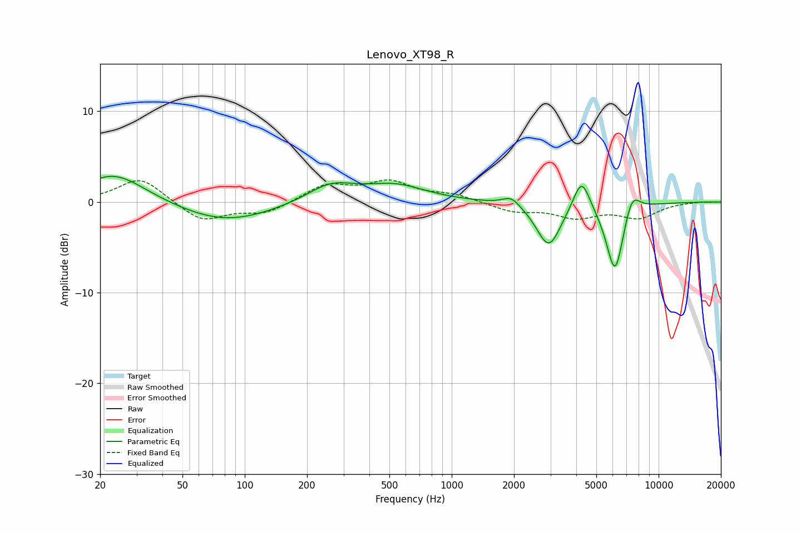

# Lenovo_XT98_R
See [usage instructions](https://github.com/jaakkopasanen/AutoEq#usage) for more options and info.

### Parametric EQs
Apply preamp of -2.9 dB when using parametric equalizer.

|   # | Type    |   Fc (Hz) |    Q |   Gain (dB) |
|-----|---------|-----------|------|-------------|
|   1 | Peaking |        20 | 5.64 |        -0.1 |
|   2 | Peaking |        23 | 0.91 |         3.3 |
|   3 | Peaking |        80 | 0.62 |        -2.3 |
|   4 | Peaking |       260 | 1.23 |         2   |
|   5 | Peaking |       531 | 0.95 |         1.7 |
|   6 | Peaking |      1944 | 3.37 |         1.1 |
|   7 | Peaking |      2947 | 2.4  |        -4.9 |
|   8 | Peaking |      4244 | 3.45 |         3.7 |
|   9 | Peaking |      6158 | 3.17 |        -8   |
|  10 | Peaking |      7426 | 3.54 |         2.6 |

### Fixed Band EQs
When using fixed band (also called graphic) equalizer, apply preamp of **-2.5 dB** (if available) and set gains manually with these parameters.

|   # | Type    |   Fc (Hz) |    Q |   Gain (dB) |
|-----|---------|-----------|------|-------------|
|   1 | Peaking |        31 | 1.41 |         2.7 |
|   2 | Peaking |        62 | 1.41 |        -2.2 |
|   3 | Peaking |       125 | 1.41 |        -1.2 |
|   4 | Peaking |       250 | 1.41 |         1.8 |
|   5 | Peaking |       500 | 1.41 |         2.1 |
|   6 | Peaking |      1000 | 1.41 |         0.7 |
|   7 | Peaking |      2000 | 1.41 |        -1   |
|   8 | Peaking |      4000 | 1.41 |        -1.5 |
|   9 | Peaking |      8000 | 1.41 |        -1.6 |
|  10 | Peaking |     16000 | 1.41 |         0.1 |

### Graphs

