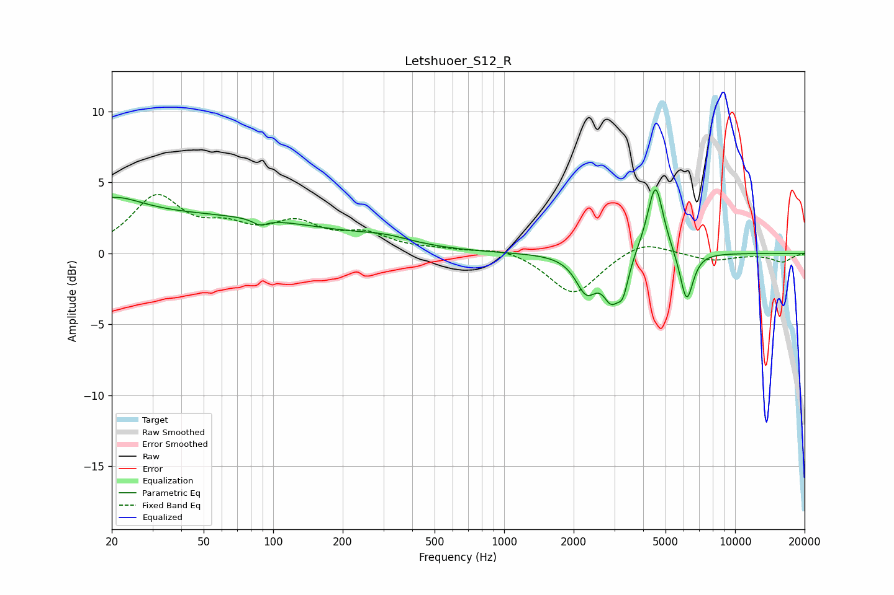

# Letshuoer_S12_R
See [usage instructions](https://github.com/jaakkopasanen/AutoEq#usage) for more options and info.

### Parametric EQs
Apply preamp of -4.6 dB when using parametric equalizer.

|   # | Type    |   Fc (Hz) |    Q |   Gain (dB) |
|-----|---------|-----------|------|-------------|
|   1 | Peaking |        20 | 1.14 |         1.5 |
|   2 | Peaking |        38 | 0.19 |         2.6 |
|   3 | Peaking |        88 | 4.58 |        -0.4 |
|   4 | Peaking |       306 | 1.17 |         0.5 |
|   5 | Peaking |      2270 | 3.09 |        -2.5 |
|   6 | Peaking |      2908 | 3.93 |        -2.5 |
|   7 | Peaking |      3270 | 5.73 |        -2   |
|   8 | Peaking |      4502 | 3.55 |         4   |
|   9 | Peaking |      4548 | 6    |         1.2 |
|  10 | Peaking |      6167 | 4.84 |        -3.6 |

### Fixed Band EQs
When using fixed band (also called graphic) equalizer, apply preamp of **-4.2 dB** (if available) and set gains manually with these parameters.

|   # | Type    |   Fc (Hz) |    Q |   Gain (dB) |
|-----|---------|-----------|------|-------------|
|   1 | Peaking |        31 | 1.41 |         3.8 |
|   2 | Peaking |        62 | 1.41 |         1.4 |
|   3 | Peaking |       125 | 1.41 |         1.8 |
|   4 | Peaking |       250 | 1.41 |         1.2 |
|   5 | Peaking |       500 | 1.41 |         0.2 |
|   6 | Peaking |      1000 | 1.41 |         0.5 |
|   7 | Peaking |      2000 | 1.41 |        -3   |
|   8 | Peaking |      4000 | 1.41 |         1   |
|   9 | Peaking |      8000 | 1.41 |        -0.5 |
|  10 | Peaking |     16000 | 1.41 |        -0.6 |

### Graphs

