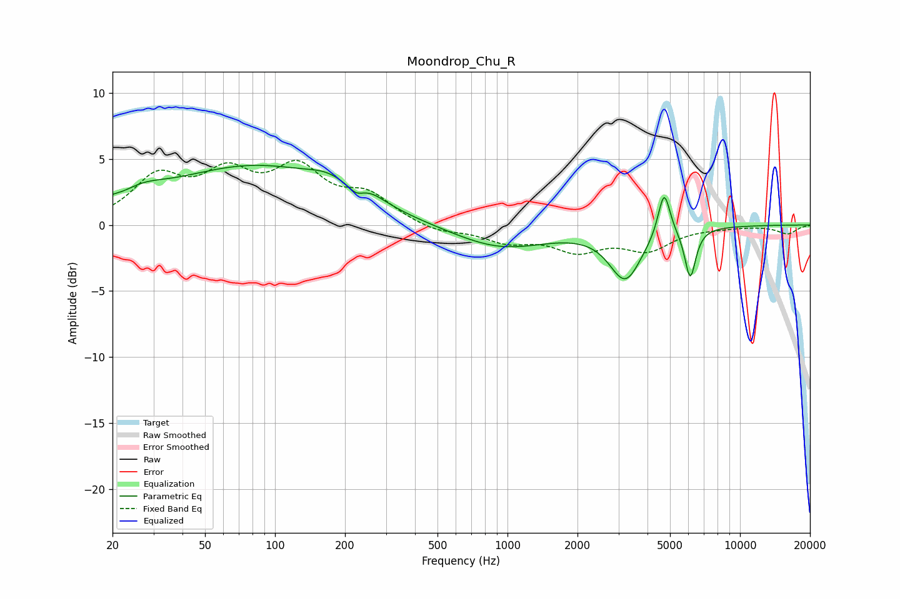

# Moondrop_Chu_R
See [usage instructions](https://github.com/jaakkopasanen/AutoEq#usage) for more options and info.

### Parametric EQs
Apply preamp of -4.6 dB when using parametric equalizer.

|   # | Type    |   Fc (Hz) |    Q |   Gain (dB) |
|-----|---------|-----------|------|-------------|
|   1 | Peaking |        20 | 5.78 |         0.3 |
|   2 | Peaking |        27 | 1.4  |         1   |
|   3 | Peaking |        82 | 0.37 |         4.4 |
|   4 | Peaking |       168 | 1.73 |         0.7 |
|   5 | Peaking |       223 | 4.47 |        -0.6 |
|   6 | Peaking |       259 | 2.26 |         0.5 |
|   7 | Peaking |       935 | 0.68 |        -1.8 |
|   8 | Peaking |      3213 | 2.04 |        -3.9 |
|   9 | Peaking |      4715 | 5.38 |         3.5 |
|  10 | Peaking |      6109 | 5.85 |        -3.8 |

### Fixed Band EQs
When using fixed band (also called graphic) equalizer, apply preamp of **-5.0 dB** (if available) and set gains manually with these parameters.

|   # | Type    |   Fc (Hz) |    Q |   Gain (dB) |
|-----|---------|-----------|------|-------------|
|   1 | Peaking |        31 | 1.41 |         3.3 |
|   2 | Peaking |        62 | 1.41 |         3.3 |
|   3 | Peaking |       125 | 1.41 |         3.8 |
|   4 | Peaking |       250 | 1.41 |         2   |
|   5 | Peaking |       500 | 1.41 |        -0.6 |
|   6 | Peaking |      1000 | 1.41 |        -1.1 |
|   7 | Peaking |      2000 | 1.41 |        -1.7 |
|   8 | Peaking |      4000 | 1.41 |        -1.7 |
|   9 | Peaking |      8000 | 1.41 |        -0.1 |
|  10 | Peaking |     16000 | 1.41 |        -0.7 |

### Graphs

