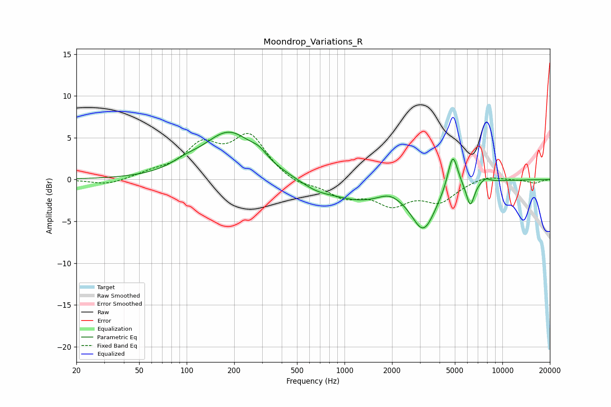

# Moondrop_Variations_R
See [usage instructions](https://github.com/jaakkopasanen/AutoEq#usage) for more options and info.

### Parametric EQs
Apply preamp of -5.8 dB when using parametric equalizer.

|   # | Type    |   Fc (Hz) |    Q |   Gain (dB) |
|-----|---------|-----------|------|-------------|
|   1 | Peaking |        98 | 1.58 |         0.7 |
|   2 | Peaking |       186 | 0.86 |         5.6 |
|   3 | Peaking |       289 | 2.91 |         0.8 |
|   4 | Peaking |       661 | 1.48 |        -0.8 |
|   5 | Peaking |      1240 | 0.71 |        -2.3 |
|   6 | Peaking |      1917 | 2.12 |         0.7 |
|   7 | Peaking |      3167 | 1.81 |        -5.5 |
|   8 | Peaking |      4848 | 4.37 |         4.4 |
|   9 | Peaking |      6263 | 5.45 |        -2.9 |
|  10 | Peaking |      7805 | 4.31 |         0.6 |

### Fixed Band EQs
When using fixed band (also called graphic) equalizer, apply preamp of **-5.6 dB** (if available) and set gains manually with these parameters.

|   # | Type    |   Fc (Hz) |    Q |   Gain (dB) |
|-----|---------|-----------|------|-------------|
|   1 | Peaking |        31 | 1.41 |        -0.7 |
|   2 | Peaking |        62 | 1.41 |         0.7 |
|   3 | Peaking |       125 | 1.41 |         3.7 |
|   4 | Peaking |       250 | 1.41 |         5   |
|   5 | Peaking |       500 | 1.41 |        -0.8 |
|   6 | Peaking |      1000 | 1.41 |        -1.9 |
|   7 | Peaking |      2000 | 1.41 |        -2.7 |
|   8 | Peaking |      4000 | 1.41 |        -2.4 |
|   9 | Peaking |      8000 | 1.41 |         0.6 |
|  10 | Peaking |     16000 | 1.41 |        -0.4 |

### Graphs

