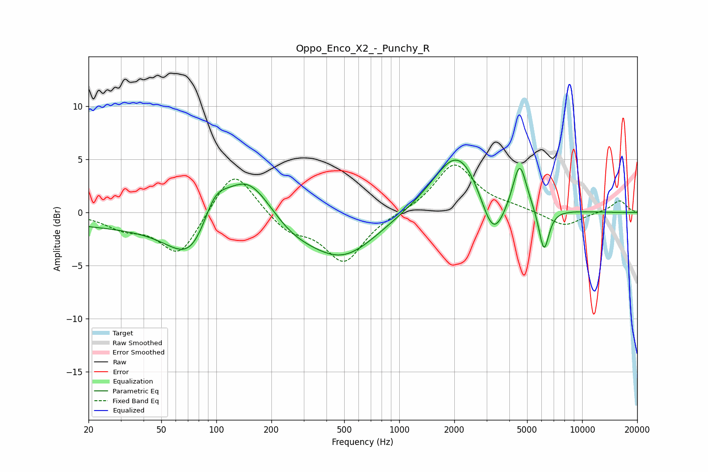

# Oppo_Enco_X2_-_Punchy_R
See [usage instructions](https://github.com/jaakkopasanen/AutoEq#usage) for more options and info.

### Parametric EQs
Apply preamp of -5.0 dB when using parametric equalizer.

|   # | Type    |   Fc (Hz) |    Q |   Gain (dB) |
|-----|---------|-----------|------|-------------|
|   1 | Peaking |        33 | 0.29 |        -1.2 |
|   2 | Peaking |        75 | 1.1  |        -4.6 |
|   3 | Peaking |        98 | 2    |         3.3 |
|   4 | Peaking |       148 | 1.03 |         4.8 |
|   5 | Peaking |       254 | 1.03 |        -1.4 |
|   6 | Peaking |       490 | 0.74 |        -4.2 |
|   7 | Peaking |      2103 | 1.03 |         6.2 |
|   8 | Peaking |      3256 | 2.08 |        -4.6 |
|   9 | Peaking |      4553 | 3.65 |         4.6 |
|  10 | Peaking |      6184 | 4.86 |        -4.1 |

### Fixed Band EQs
When using fixed band (also called graphic) equalizer, apply preamp of **-4.6 dB** (if available) and set gains manually with these parameters.

|   # | Type    |   Fc (Hz) |    Q |   Gain (dB) |
|-----|---------|-----------|------|-------------|
|   1 | Peaking |        31 | 1.41 |        -1.2 |
|   2 | Peaking |        62 | 1.41 |        -4.1 |
|   3 | Peaking |       125 | 1.41 |         4.4 |
|   4 | Peaking |       250 | 1.41 |        -1.7 |
|   5 | Peaking |       500 | 1.41 |        -4.6 |
|   6 | Peaking |      1000 | 1.41 |        -0   |
|   7 | Peaking |      2000 | 1.41 |         4.6 |
|   8 | Peaking |      4000 | 1.41 |         0.4 |
|   9 | Peaking |      8000 | 1.41 |        -1.3 |
|  10 | Peaking |     16000 | 1.41 |         1.2 |

### Graphs

