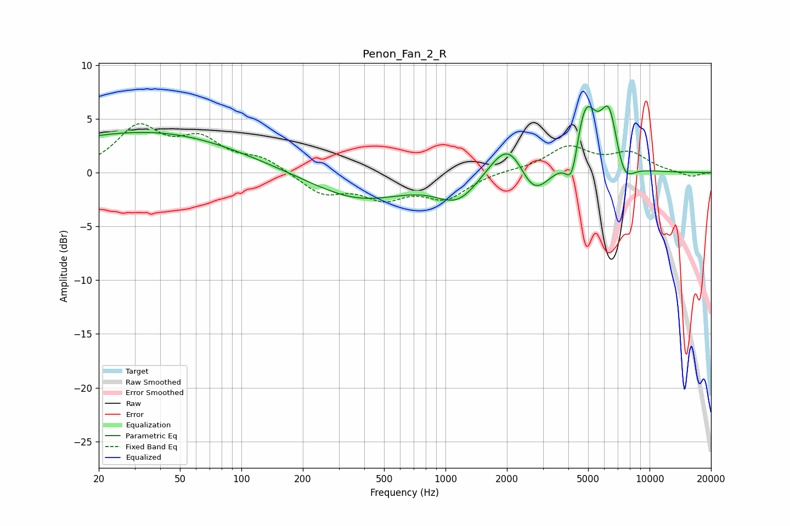

# Penon_Fan_2_R
See [usage instructions](https://github.com/jaakkopasanen/AutoEq#usage) for more options and info.

### Parametric EQs
Apply preamp of -6.3 dB when using parametric equalizer.

|   # | Type    |   Fc (Hz) |    Q |   Gain (dB) |
|-----|---------|-----------|------|-------------|
|   1 | Peaking |        21 | 0.25 |         2.5 |
|   2 | Peaking |        49 | 0.37 |         1.6 |
|   3 | Peaking |       377 | 0.61 |        -2.5 |
|   4 | Peaking |      1155 | 1.37 |        -2.5 |
|   5 | Peaking |      2068 | 1.49 |         4.3 |
|   6 | Peaking |      2674 | 1.75 |        -3.7 |
|   7 | Peaking |      4170 | 4.43 |        -3.6 |
|   8 | Peaking |      4830 | 2.52 |         6.4 |
|   9 | Peaking |      6341 | 3.23 |         5.3 |
|  10 | Peaking |      7495 | 2.95 |        -2.3 |

### Fixed Band EQs
When using fixed band (also called graphic) equalizer, apply preamp of **-4.7 dB** (if available) and set gains manually with these parameters.

|   # | Type    |   Fc (Hz) |    Q |   Gain (dB) |
|-----|---------|-----------|------|-------------|
|   1 | Peaking |        31 | 1.41 |         4   |
|   2 | Peaking |        62 | 1.41 |         2.7 |
|   3 | Peaking |       125 | 1.41 |         1.2 |
|   4 | Peaking |       250 | 1.41 |        -1.9 |
|   5 | Peaking |       500 | 1.41 |        -2.1 |
|   6 | Peaking |      1000 | 1.41 |        -2.2 |
|   7 | Peaking |      2000 | 1.41 |         0.2 |
|   8 | Peaking |      4000 | 1.41 |         2.3 |
|   9 | Peaking |      8000 | 1.41 |         1.7 |
|  10 | Peaking |     16000 | 1.41 |        -0.4 |

### Graphs

