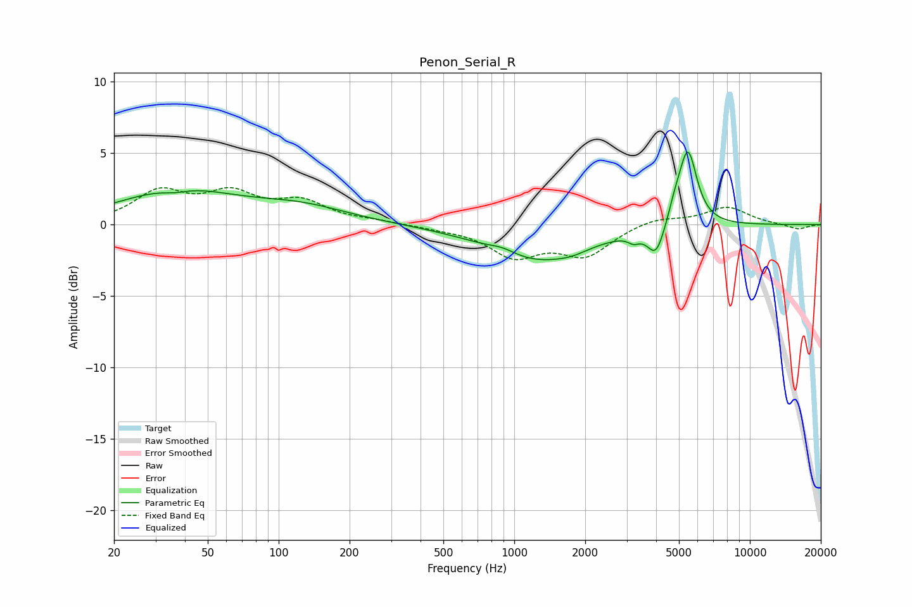

# Penon_Serial_R
See [usage instructions](https://github.com/jaakkopasanen/AutoEq#usage) for more options and info.

### Parametric EQs
Apply preamp of -5.2 dB when using parametric equalizer.

|   # | Type    |   Fc (Hz) |    Q |   Gain (dB) |
|-----|---------|-----------|------|-------------|
|   1 | Peaking |        36 | 2.67 |        -0.3 |
|   2 | Peaking |        37 | 0.57 |         2.3 |
|   3 | Peaking |       124 | 0.69 |         1.1 |
|   4 | Peaking |       892 | 2.37 |         0.4 |
|   5 | Peaking |      1236 | 0.67 |        -2.5 |
|   6 | Peaking |      1752 | 2.16 |        -0.3 |
|   7 | Peaking |      3211 | 6    |        -0.4 |
|   8 | Peaking |      4000 | 3.81 |        -2.1 |
|   9 | Peaking |      4798 | 5.04 |         0.8 |
|  10 | Peaking |      5452 | 3.6  |         5.3 |

### Fixed Band EQs
When using fixed band (also called graphic) equalizer, apply preamp of **-2.7 dB** (if available) and set gains manually with these parameters.

|   # | Type    |   Fc (Hz) |    Q |   Gain (dB) |
|-----|---------|-----------|------|-------------|
|   1 | Peaking |        31 | 1.41 |         2.2 |
|   2 | Peaking |        62 | 1.41 |         1.9 |
|   3 | Peaking |       125 | 1.41 |         1.4 |
|   4 | Peaking |       250 | 1.41 |         0.2 |
|   5 | Peaking |       500 | 1.41 |        -0.2 |
|   6 | Peaking |      1000 | 1.41 |        -2.1 |
|   7 | Peaking |      2000 | 1.41 |        -2   |
|   8 | Peaking |      4000 | 1.41 |         0.5 |
|   9 | Peaking |      8000 | 1.41 |         1.2 |
|  10 | Peaking |     16000 | 1.41 |        -0.4 |

### Graphs

