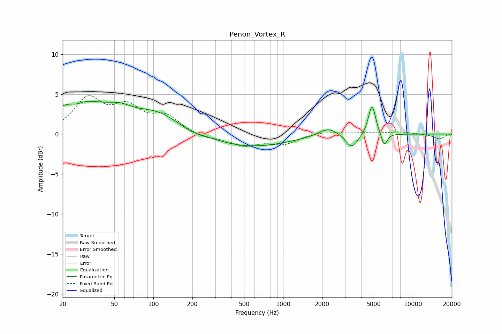

# Penon_Vortex_R
See [usage instructions](https://github.com/jaakkopasanen/AutoEq#usage) for more options and info.

### Parametric EQs
Apply preamp of -4.2 dB when using parametric equalizer.

|   # | Type    |   Fc (Hz) |    Q |   Gain (dB) |
|-----|---------|-----------|------|-------------|
|   1 | Peaking |        26 | 3.62 |        -0.4 |
|   2 | Peaking |        26 | 0.6  |         3.9 |
|   3 | Peaking |        55 | 1.51 |         1   |
|   4 | Peaking |       106 | 0.83 |         2.2 |
|   5 | Peaking |       197 | 2.83 |        -0.3 |
|   6 | Peaking |       554 | 0.48 |        -1.6 |
|   7 | Peaking |      2246 | 1.83 |         1.1 |
|   8 | Peaking |      3385 | 2.99 |        -1.8 |
|   9 | Peaking |      4850 | 4.99 |         3.8 |
|  10 | Peaking |      6028 | 5.96 |        -1.7 |

### Fixed Band EQs
When using fixed band (also called graphic) equalizer, apply preamp of **-4.9 dB** (if available) and set gains manually with these parameters.

|   # | Type    |   Fc (Hz) |    Q |   Gain (dB) |
|-----|---------|-----------|------|-------------|
|   1 | Peaking |        31 | 1.41 |         4.2 |
|   2 | Peaking |        62 | 1.41 |         2.9 |
|   3 | Peaking |       125 | 1.41 |         2   |
|   4 | Peaking |       250 | 1.41 |        -0.6 |
|   5 | Peaking |       500 | 1.41 |        -1.3 |
|   6 | Peaking |      1000 | 1.41 |        -1.2 |
|   7 | Peaking |      2000 | 1.41 |         0.3 |
|   8 | Peaking |      4000 | 1.41 |         0.1 |
|   9 | Peaking |      8000 | 1.41 |         0.3 |
|  10 | Peaking |     16000 | 1.41 |        -0.6 |

### Graphs

