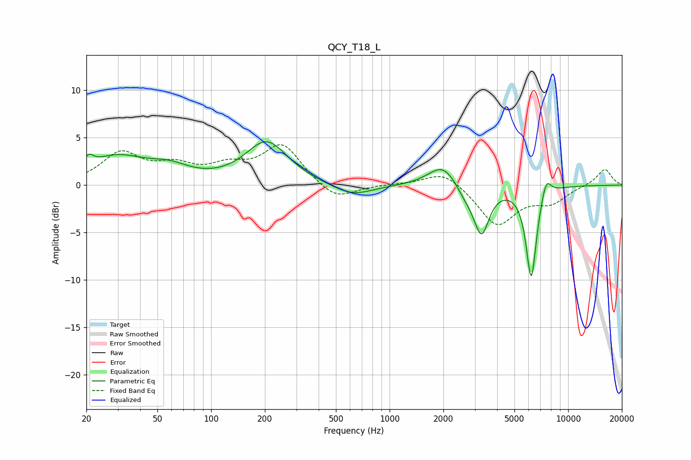

# QCY_T18_L
See [usage instructions](https://github.com/jaakkopasanen/AutoEq#usage) for more options and info.

### Parametric EQs
Apply preamp of -4.7 dB when using parametric equalizer.

|   # | Type    |   Fc (Hz) |    Q |   Gain (dB) |
|-----|---------|-----------|------|-------------|
|   1 | Peaking |        21 | 5.7  |         1   |
|   2 | Peaking |        29 | 0.84 |         2.8 |
|   3 | Peaking |        59 | 1.25 |         1.2 |
|   4 | Peaking |       205 | 1.2  |         4.5 |
|   5 | Peaking |       618 | 1.23 |        -1.2 |
|   6 | Peaking |      1992 | 1.77 |         2.4 |
|   7 | Peaking |      2672 | 2.45 |        -1.2 |
|   8 | Peaking |      3270 | 3.36 |        -4.9 |
|   9 | Peaking |      6213 | 4.67 |        -9.8 |
|  10 | Peaking |      7534 | 5.05 |         2   |

### Fixed Band EQs
When using fixed band (also called graphic) equalizer, apply preamp of **-4.4 dB** (if available) and set gains manually with these parameters.

|   # | Type    |   Fc (Hz) |    Q |   Gain (dB) |
|-----|---------|-----------|------|-------------|
|   1 | Peaking |        31 | 1.41 |         3.2 |
|   2 | Peaking |        62 | 1.41 |         1.7 |
|   3 | Peaking |       125 | 1.41 |         1.6 |
|   4 | Peaking |       250 | 1.41 |         4.2 |
|   5 | Peaking |       500 | 1.41 |        -1.7 |
|   6 | Peaking |      1000 | 1.41 |         0.1 |
|   7 | Peaking |      2000 | 1.41 |         1.6 |
|   8 | Peaking |      4000 | 1.41 |        -4.2 |
|   9 | Peaking |      8000 | 1.41 |        -1.6 |
|  10 | Peaking |     16000 | 1.41 |         1.7 |

### Graphs

