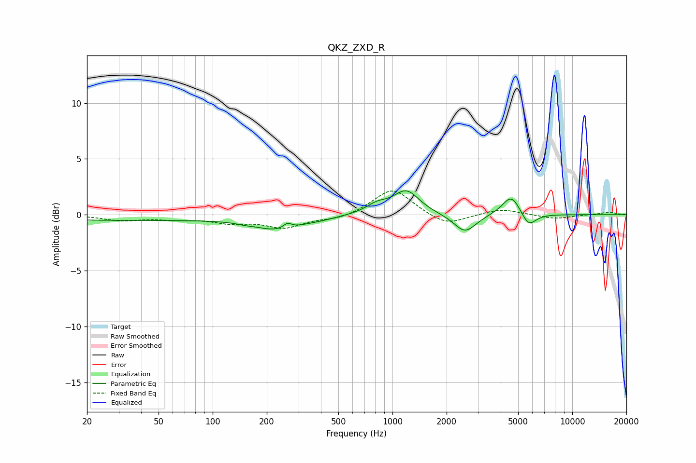

# QKZ_ZXD_R
See [usage instructions](https://github.com/jaakkopasanen/AutoEq#usage) for more options and info.

### Parametric EQs
Apply preamp of -2.2 dB when using parametric equalizer.

|   # | Type    |   Fc (Hz) |    Q |   Gain (dB) |
|-----|---------|-----------|------|-------------|
|   1 | Peaking |        30 | 0.18 |        -0.5 |
|   2 | Peaking |       150 | 3.48 |        -0.1 |
|   3 | Peaking |       232 | 1.07 |        -1.2 |
|   4 | Peaking |       260 | 5.98 |         0.5 |
|   5 | Peaking |       401 | 1.8  |        -0.2 |
|   6 | Peaking |       818 | 2.32 |         0.7 |
|   7 | Peaking |      1194 | 1.97 |         2.1 |
|   8 | Peaking |      2533 | 2.3  |        -1.7 |
|   9 | Peaking |      4592 | 2.75 |         1.9 |
|  10 | Peaking |      5705 | 3.38 |        -1.3 |

### Fixed Band EQs
When using fixed band (also called graphic) equalizer, apply preamp of **-2.2 dB** (if available) and set gains manually with these parameters.

|   # | Type    |   Fc (Hz) |    Q |   Gain (dB) |
|-----|---------|-----------|------|-------------|
|   1 | Peaking |        31 | 1.41 |        -0.5 |
|   2 | Peaking |        62 | 1.41 |        -0.3 |
|   3 | Peaking |       125 | 1.41 |        -0.6 |
|   4 | Peaking |       250 | 1.41 |        -1.1 |
|   5 | Peaking |       500 | 1.41 |        -0.4 |
|   6 | Peaking |      1000 | 1.41 |         2.4 |
|   7 | Peaking |      2000 | 1.41 |        -1.1 |
|   8 | Peaking |      4000 | 1.41 |         0.5 |
|   9 | Peaking |      8000 | 1.41 |        -0.4 |
|  10 | Peaking |     16000 | 1.41 |         0.2 |

### Graphs

