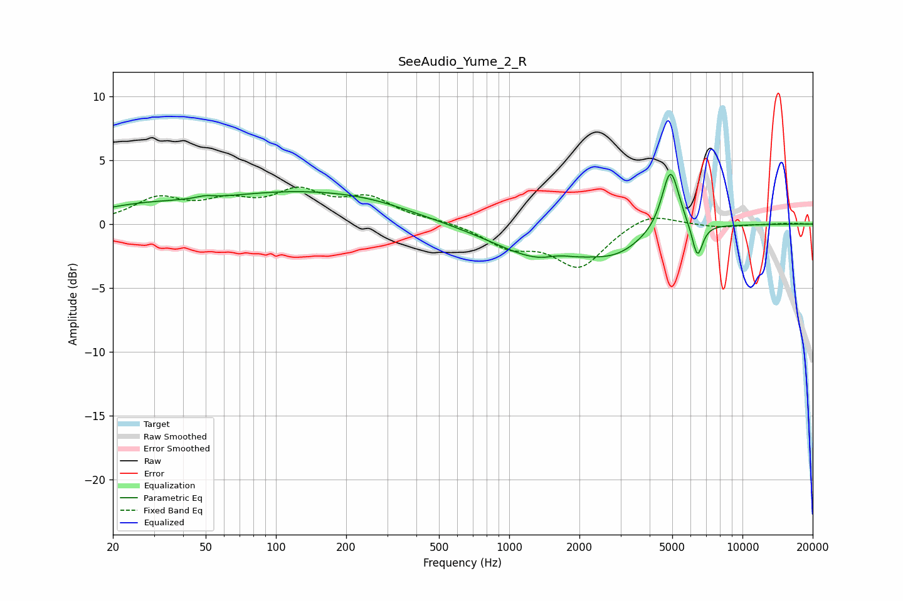

# SeeAudio_Yume_2_R
See [usage instructions](https://github.com/jaakkopasanen/AutoEq#usage) for more options and info.

### Parametric EQs
Apply preamp of -4.0 dB when using parametric equalizer.

|   # | Type    |   Fc (Hz) |    Q |   Gain (dB) |
|-----|---------|-----------|------|-------------|
|   1 | Peaking |        26 | 0.63 |         1   |
|   2 | Peaking |        50 | 3.95 |         0.2 |
|   3 | Peaking |       126 | 0.37 |         2.3 |
|   4 | Peaking |       259 | 0.82 |         0.3 |
|   5 | Peaking |      1421 | 0.66 |        -2.7 |
|   6 | Peaking |      1471 | 1.46 |        -0.2 |
|   7 | Peaking |      1625 | 2.38 |         0.5 |
|   8 | Peaking |      2907 | 1.26 |        -1.3 |
|   9 | Peaking |      4913 | 3.75 |         5   |
|  10 | Peaking |      6407 | 6    |        -2.7 |

### Fixed Band EQs
When using fixed band (also called graphic) equalizer, apply preamp of **-3.0 dB** (if available) and set gains manually with these parameters.

|   # | Type    |   Fc (Hz) |    Q |   Gain (dB) |
|-----|---------|-----------|------|-------------|
|   1 | Peaking |        31 | 1.41 |         1.8 |
|   2 | Peaking |        62 | 1.41 |         1.4 |
|   3 | Peaking |       125 | 1.41 |         2.2 |
|   4 | Peaking |       250 | 1.41 |         1.8 |
|   5 | Peaking |       500 | 1.41 |         0.2 |
|   6 | Peaking |      1000 | 1.41 |        -1.6 |
|   7 | Peaking |      2000 | 1.41 |        -3.3 |
|   8 | Peaking |      4000 | 1.41 |         1.1 |
|   9 | Peaking |      8000 | 1.41 |        -0.3 |
|  10 | Peaking |     16000 | 1.41 |         0.1 |

### Graphs

