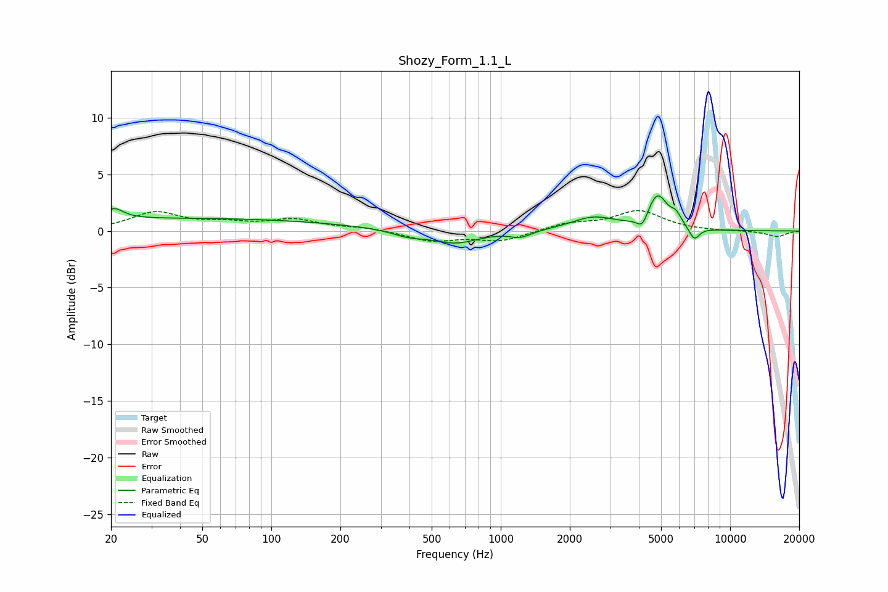

# Shozy_Form_1.1_L
See [usage instructions](https://github.com/jaakkopasanen/AutoEq#usage) for more options and info.

### Parametric EQs
Apply preamp of -3.2 dB when using parametric equalizer.

|   # | Type    |   Fc (Hz) |    Q |   Gain (dB) |
|-----|---------|-----------|------|-------------|
|   1 | Peaking |        21 | 3.58 |         0.9 |
|   2 | Peaking |        42 | 0.18 |         1.1 |
|   3 | Peaking |       396 | 1.98 |        -0.5 |
|   4 | Peaking |       634 | 1.4  |        -1.1 |
|   5 | Peaking |      1222 | 3.08 |        -0.6 |
|   6 | Peaking |      2536 | 1.44 |         1.2 |
|   7 | Peaking |      4145 | 5.95 |        -1.1 |
|   8 | Peaking |      4818 | 3.17 |         3.1 |
|   9 | Peaking |      5812 | 6    |         0.8 |
|  10 | Peaking |      6975 | 5.96 |        -1.2 |

### Fixed Band EQs
When using fixed band (also called graphic) equalizer, apply preamp of **-1.9 dB** (if available) and set gains manually with these parameters.

|   # | Type    |   Fc (Hz) |    Q |   Gain (dB) |
|-----|---------|-----------|------|-------------|
|   1 | Peaking |        31 | 1.41 |         1.6 |
|   2 | Peaking |        62 | 1.41 |         0.6 |
|   3 | Peaking |       125 | 1.41 |         0.9 |
|   4 | Peaking |       250 | 1.41 |         0.3 |
|   5 | Peaking |       500 | 1.41 |        -0.9 |
|   6 | Peaking |      1000 | 1.41 |        -0.9 |
|   7 | Peaking |      2000 | 1.41 |         0.6 |
|   8 | Peaking |      4000 | 1.41 |         1.7 |
|   9 | Peaking |      8000 | 1.41 |        -0   |
|  10 | Peaking |     16000 | 1.41 |        -0.5 |

### Graphs

