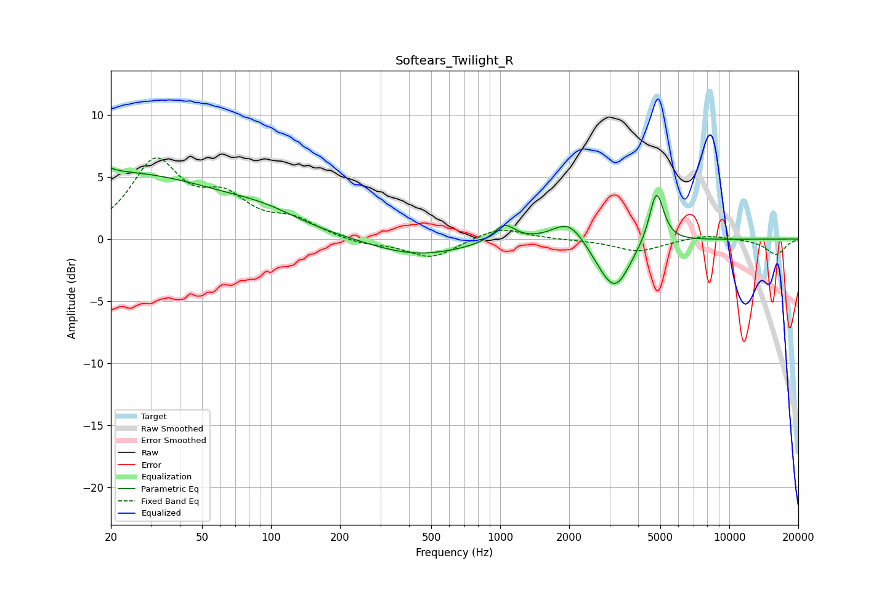

# Softears_Twilight_R
See [usage instructions](https://github.com/jaakkopasanen/AutoEq#usage) for more options and info.

### Parametric EQs
Apply preamp of -5.8 dB when using parametric equalizer.

|   # | Type    |   Fc (Hz) |    Q |   Gain (dB) |
|-----|---------|-----------|------|-------------|
|   1 | Peaking |        20 | 0.27 |         5.3 |
|   2 | Peaking |        20 | 5.7  |         3.1 |
|   3 | Peaking |        20 | 5.82 |        -2.8 |
|   4 | Peaking |        94 | 0.94 |         0.8 |
|   5 | Peaking |       432 | 0.69 |        -1.4 |
|   6 | Peaking |      1042 | 3.05 |         1.4 |
|   7 | Peaking |      2001 | 1.93 |         1.9 |
|   8 | Peaking |      2766 | 1.92 |        -0.9 |
|   9 | Peaking |      3191 | 2.18 |        -3.5 |
|  10 | Peaking |      4809 | 4.51 |         4.3 |

### Fixed Band EQs
When using fixed band (also called graphic) equalizer, apply preamp of **-6.6 dB** (if available) and set gains manually with these parameters.

|   # | Type    |   Fc (Hz) |    Q |   Gain (dB) |
|-----|---------|-----------|------|-------------|
|   1 | Peaking |        31 | 1.41 |         6   |
|   2 | Peaking |        62 | 1.41 |         2.8 |
|   3 | Peaking |       125 | 1.41 |         1.3 |
|   4 | Peaking |       250 | 1.41 |        -0.4 |
|   5 | Peaking |       500 | 1.41 |        -1.6 |
|   6 | Peaking |      1000 | 1.41 |         1   |
|   7 | Peaking |      2000 | 1.41 |        -0   |
|   8 | Peaking |      4000 | 1.41 |        -1   |
|   9 | Peaking |      8000 | 1.41 |         0.4 |
|  10 | Peaking |     16000 | 1.41 |        -1.3 |

### Graphs

