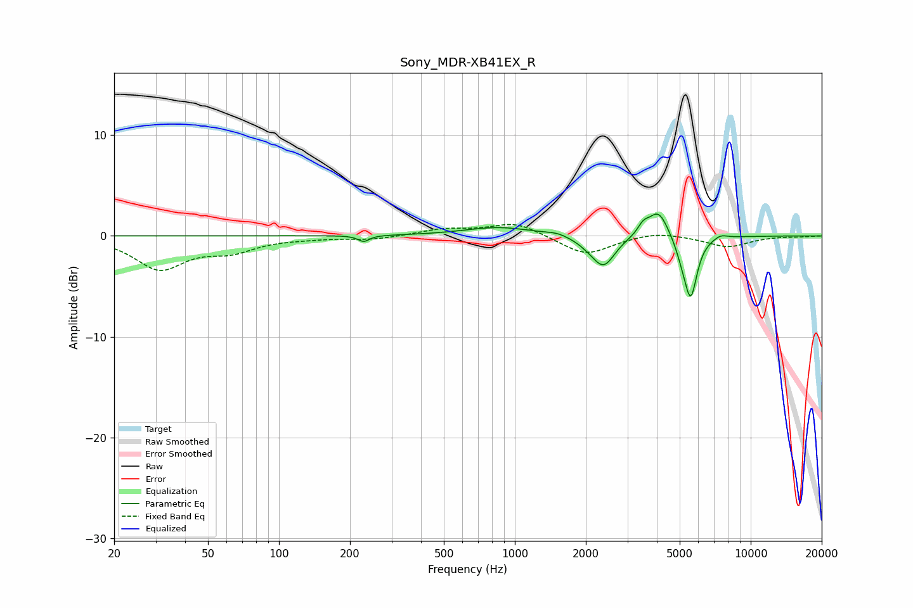

# Sony_MDR-XB41EX_R
See [usage instructions](https://github.com/jaakkopasanen/AutoEq#usage) for more options and info.

### Parametric EQs
Apply preamp of -2.3 dB when using parametric equalizer.

|   # | Type    |   Fc (Hz) |    Q |   Gain (dB) |
|-----|---------|-----------|------|-------------|
|   1 | Peaking |       229 | 6    |        -0.6 |
|   2 | Peaking |       857 | 0.96 |         0.9 |
|   3 | Peaking |      1512 | 3.05 |         0.3 |
|   4 | Peaking |      2094 | 2.55 |        -0.6 |
|   5 | Peaking |      2388 | 2.99 |        -2.7 |
|   6 | Peaking |      3502 | 5.99 |         0.9 |
|   7 | Peaking |      4064 | 3.32 |         2.7 |
|   8 | Peaking |      5122 | 4.79 |        -1.1 |
|   9 | Peaking |      5568 | 5.14 |        -5.8 |
|  10 | Peaking |      7448 | 4.72 |         0.4 |

### Fixed Band EQs
When using fixed band (also called graphic) equalizer, apply preamp of **-1.2 dB** (if available) and set gains manually with these parameters.

|   # | Type    |   Fc (Hz) |    Q |   Gain (dB) |
|-----|---------|-----------|------|-------------|
|   1 | Peaking |        31 | 1.41 |        -3.2 |
|   2 | Peaking |        62 | 1.41 |        -1.3 |
|   3 | Peaking |       125 | 1.41 |        -0.2 |
|   4 | Peaking |       250 | 1.41 |        -0.3 |
|   5 | Peaking |       500 | 1.41 |         0.6 |
|   6 | Peaking |      1000 | 1.41 |         1.3 |
|   7 | Peaking |      2000 | 1.41 |        -1.9 |
|   8 | Peaking |      4000 | 1.41 |         0.5 |
|   9 | Peaking |      8000 | 1.41 |        -1.1 |
|  10 | Peaking |     16000 | 1.41 |        -0.1 |

### Graphs

