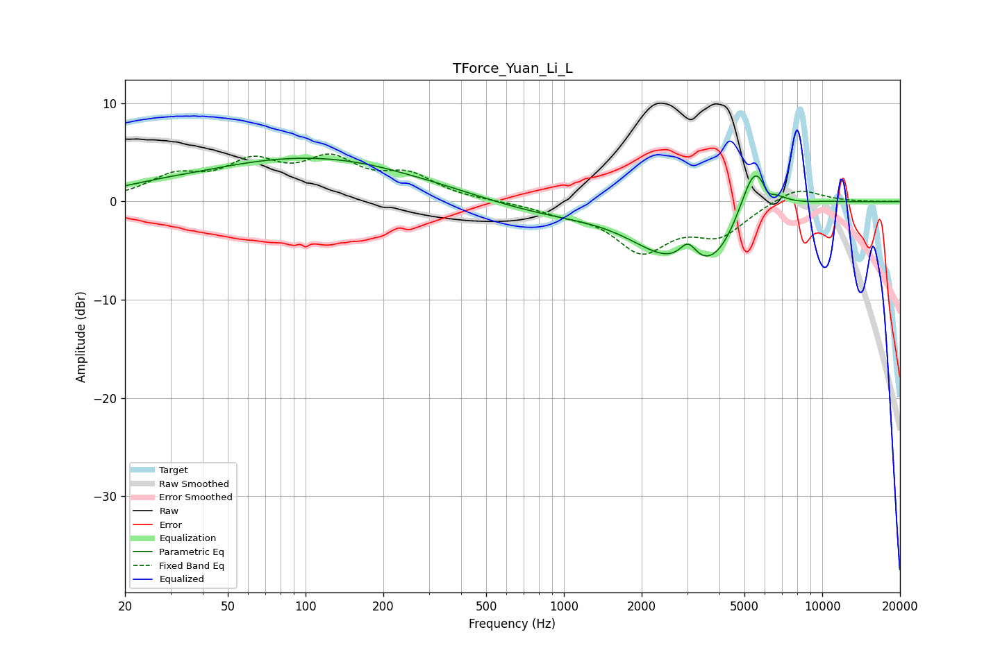

# TForce_Yuan_Li_L
See [usage instructions](https://github.com/jaakkopasanen/AutoEq#usage) for more options and info.

### Parametric EQs
Apply preamp of -4.5 dB when using parametric equalizer.

|   # | Type    |   Fc (Hz) |    Q |   Gain (dB) |
|-----|---------|-----------|------|-------------|
|   1 | Peaking |        25 | 0.93 |         0.4 |
|   2 | Peaking |       105 | 0.32 |         4.4 |
|   3 | Peaking |       246 | 1.63 |        -0.1 |
|   4 | Peaking |       861 | 0.54 |        -1.3 |
|   5 | Peaking |      2399 | 0.98 |        -2.9 |
|   6 | Peaking |      3026 | 4.2  |         2.1 |
|   7 | Peaking |      3802 | 1.05 |        -5.8 |
|   8 | Peaking |      5493 | 2.16 |         6.9 |
|   9 | Peaking |      6142 | 6    |        -1.4 |
|  10 | Peaking |     10000 | 1.14 |         0.2 |

### Fixed Band EQs
When using fixed band (also called graphic) equalizer, apply preamp of **-4.9 dB** (if available) and set gains manually with these parameters.

|   # | Type    |   Fc (Hz) |    Q |   Gain (dB) |
|-----|---------|-----------|------|-------------|
|   1 | Peaking |        31 | 1.41 |         2.3 |
|   2 | Peaking |        62 | 1.41 |         3.4 |
|   3 | Peaking |       125 | 1.41 |         3.7 |
|   4 | Peaking |       250 | 1.41 |         2.4 |
|   5 | Peaking |       500 | 1.41 |         0   |
|   6 | Peaking |      1000 | 1.41 |        -0.9 |
|   7 | Peaking |      2000 | 1.41 |        -4.7 |
|   8 | Peaking |      4000 | 1.41 |        -3.1 |
|   9 | Peaking |      8000 | 1.41 |         1.6 |
|  10 | Peaking |     16000 | 1.41 |        -0   |

### Graphs

