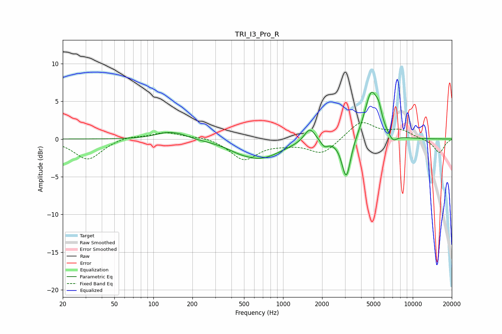

# TRI_I3_Pro_R
See [usage instructions](https://github.com/jaakkopasanen/AutoEq#usage) for more options and info.

### Parametric EQs
Apply preamp of -6.3 dB when using parametric equalizer.

|   # | Type    |   Fc (Hz) |    Q |   Gain (dB) |
|-----|---------|-----------|------|-------------|
|   1 | Peaking |       129 | 1.46 |         0.9 |
|   2 | Peaking |       164 | 2.11 |         0.3 |
|   3 | Peaking |       448 | 1.71 |        -0.3 |
|   4 | Peaking |       665 | 0.87 |        -2.5 |
|   5 | Peaking |      1608 | 3.27 |         1.9 |
|   6 | Peaking |      2083 | 4.89 |        -0.9 |
|   7 | Peaking |      3073 | 4.1  |        -5.5 |
|   8 | Peaking |      4788 | 2.69 |         6.3 |
|   9 | Peaking |      5466 | 5.99 |         1.6 |
|  10 | Peaking |      7014 | 4.07 |        -1   |

### Fixed Band EQs
When using fixed band (also called graphic) equalizer, apply preamp of **-2.3 dB** (if available) and set gains manually with these parameters.

|   # | Type    |   Fc (Hz) |    Q |   Gain (dB) |
|-----|---------|-----------|------|-------------|
|   1 | Peaking |        31 | 1.41 |        -2.7 |
|   2 | Peaking |        62 | 1.41 |         0.4 |
|   3 | Peaking |       125 | 1.41 |         0.9 |
|   4 | Peaking |       250 | 1.41 |         0.4 |
|   5 | Peaking |       500 | 1.41 |        -2.7 |
|   6 | Peaking |      1000 | 1.41 |        -0.4 |
|   7 | Peaking |      2000 | 1.41 |        -2   |
|   8 | Peaking |      4000 | 1.41 |         2.4 |
|   9 | Peaking |      8000 | 1.41 |         1.1 |
|  10 | Peaking |     16000 | 1.41 |        -1.8 |

### Graphs

