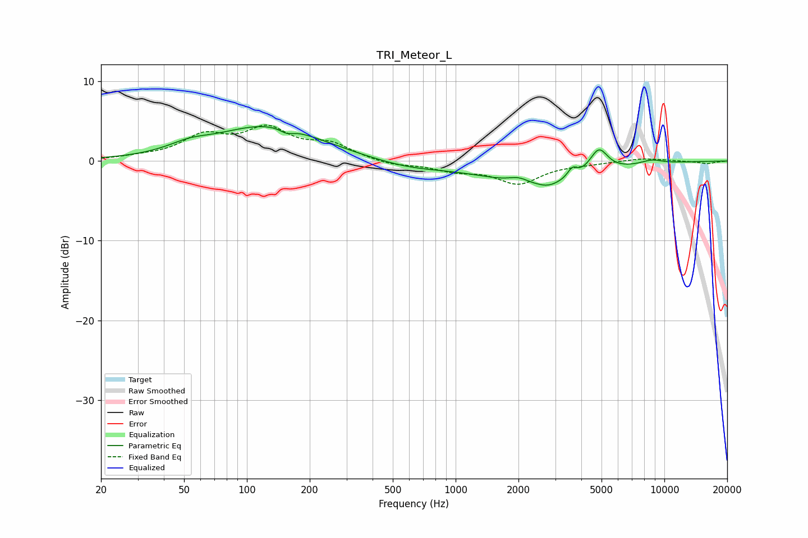

# TRI_Meteor_L
See [usage instructions](https://github.com/jaakkopasanen/AutoEq#usage) for more options and info.

### Parametric EQs
Apply preamp of -4.4 dB when using parametric equalizer.

|   # | Type    |   Fc (Hz) |    Q |   Gain (dB) |
|-----|---------|-----------|------|-------------|
|   1 | Peaking |        53 | 1.45 |         0.9 |
|   2 | Peaking |       127 | 0.56 |         4.4 |
|   3 | Peaking |       155 | 4.44 |        -0.6 |
|   4 | Peaking |       602 | 0.79 |        -0.9 |
|   5 | Peaking |      2003 | 2.87 |         0.8 |
|   6 | Peaking |      2567 | 0.58 |        -3.1 |
|   7 | Peaking |      2770 | 3.26 |        -0.4 |
|   8 | Peaking |      3624 | 6    |         1.2 |
|   9 | Peaking |      4849 | 3.21 |         3.1 |
|  10 | Peaking |      8665 | 2.42 |         0.6 |

### Fixed Band EQs
When using fixed band (also called graphic) equalizer, apply preamp of **-4.6 dB** (if available) and set gains manually with these parameters.

|   # | Type    |   Fc (Hz) |    Q |   Gain (dB) |
|-----|---------|-----------|------|-------------|
|   1 | Peaking |        31 | 1.41 |         0.3 |
|   2 | Peaking |        62 | 1.41 |         2.9 |
|   3 | Peaking |       125 | 1.41 |         3.7 |
|   4 | Peaking |       250 | 1.41 |         1.9 |
|   5 | Peaking |       500 | 1.41 |        -0.6 |
|   6 | Peaking |      1000 | 1.41 |        -1.1 |
|   7 | Peaking |      2000 | 1.41 |        -2.7 |
|   8 | Peaking |      4000 | 1.41 |        -0.3 |
|   9 | Peaking |      8000 | 1.41 |         0.4 |
|  10 | Peaking |     16000 | 1.41 |        -0.3 |

### Graphs

