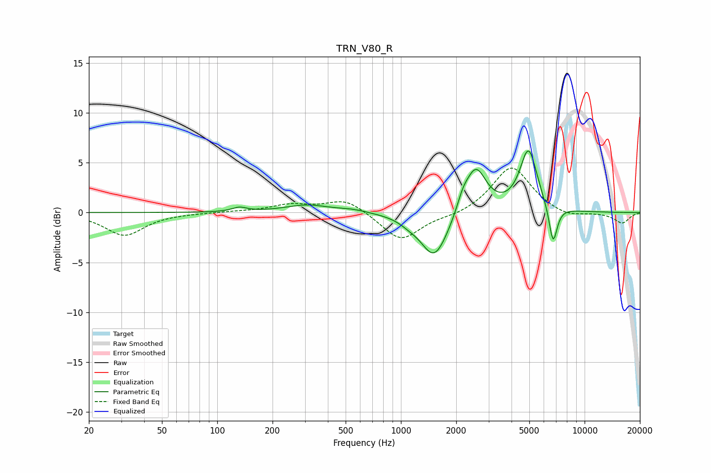

# TRN_V80_R
See [usage instructions](https://github.com/jaakkopasanen/AutoEq#usage) for more options and info.

### Parametric EQs
Apply preamp of -6.3 dB when using parametric equalizer.

|   # | Type    |   Fc (Hz) |    Q |   Gain (dB) |
|-----|---------|-----------|------|-------------|
|   1 | Peaking |       132 | 3.63 |         0.4 |
|   2 | Peaking |       308 | 1.19 |         0.7 |
|   3 | Peaking |       543 | 1.74 |         0.3 |
|   4 | Peaking |      1109 | 2.67 |        -0.4 |
|   5 | Peaking |      1512 | 2.02 |        -3.9 |
|   6 | Peaking |      1677 | 1.44 |        -0.9 |
|   7 | Peaking |      2169 | 4.33 |         1.2 |
|   8 | Peaking |      2554 | 2.43 |         4.6 |
|   9 | Peaking |      4950 | 2.94 |         6.2 |
|  10 | Peaking |      6735 | 6    |        -3.9 |

### Fixed Band EQs
When using fixed band (also called graphic) equalizer, apply preamp of **-4.6 dB** (if available) and set gains manually with these parameters.

|   # | Type    |   Fc (Hz) |    Q |   Gain (dB) |
|-----|---------|-----------|------|-------------|
|   1 | Peaking |        31 | 1.41 |        -2.3 |
|   2 | Peaking |        62 | 1.41 |        -0   |
|   3 | Peaking |       125 | 1.41 |         0.1 |
|   4 | Peaking |       250 | 1.41 |         0.7 |
|   5 | Peaking |       500 | 1.41 |         1.4 |
|   6 | Peaking |      1000 | 1.41 |        -2.9 |
|   7 | Peaking |      2000 | 1.41 |        -0.4 |
|   8 | Peaking |      4000 | 1.41 |         4.7 |
|   9 | Peaking |      8000 | 1.41 |        -0.6 |
|  10 | Peaking |     16000 | 1.41 |        -1.1 |

### Graphs

