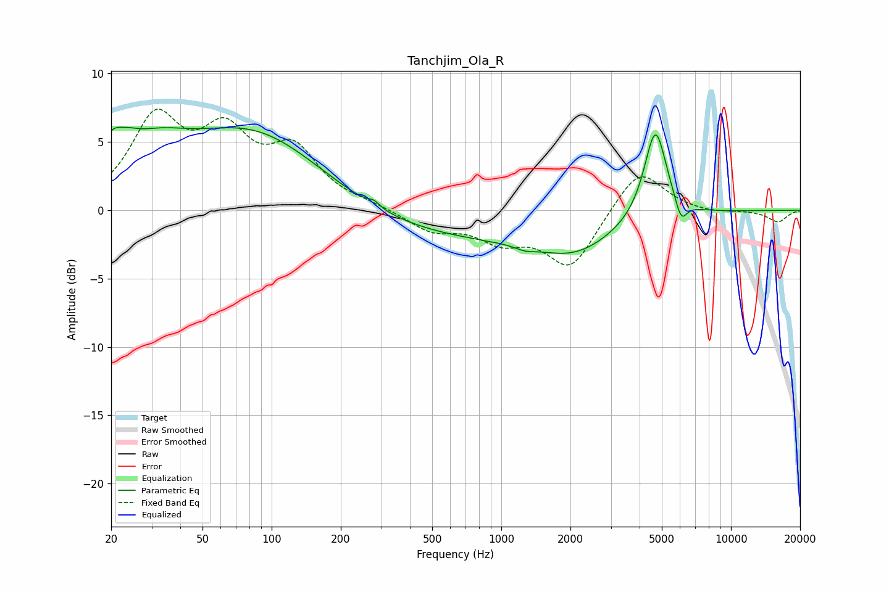

# Tanchjim_Ola_R
See [usage instructions](https://github.com/jaakkopasanen/AutoEq#usage) for more options and info.

### Parametric EQs
Apply preamp of -6.2 dB when using parametric equalizer.

|   # | Type    |   Fc (Hz) |    Q |   Gain (dB) |
|-----|---------|-----------|------|-------------|
|   1 | Peaking |        20 | 3.51 |         2   |
|   2 | Peaking |        23 | 2.45 |         1.2 |
|   3 | Peaking |        31 | 0.94 |         2.8 |
|   4 | Peaking |        84 | 0.45 |         5.8 |
|   5 | Peaking |       279 | 5.97 |         0.4 |
|   6 | Peaking |       688 | 0.23 |        -2.1 |
|   7 | Peaking |      1269 | 3.47 |        -0.3 |
|   8 | Peaking |      2102 | 0.87 |        -1.8 |
|   9 | Peaking |      4687 | 2.86 |         6.8 |
|  10 | Peaking |      6067 | 5.46 |        -1.6 |

### Fixed Band EQs
When using fixed band (also called graphic) equalizer, apply preamp of **-7.5 dB** (if available) and set gains manually with these parameters.

|   # | Type    |   Fc (Hz) |    Q |   Gain (dB) |
|-----|---------|-----------|------|-------------|
|   1 | Peaking |        31 | 1.41 |         6.3 |
|   2 | Peaking |        62 | 1.41 |         4.8 |
|   3 | Peaking |       125 | 1.41 |         4   |
|   4 | Peaking |       250 | 1.41 |         0.3 |
|   5 | Peaking |       500 | 1.41 |        -1.4 |
|   6 | Peaking |      1000 | 1.41 |        -1.9 |
|   7 | Peaking |      2000 | 1.41 |        -4.1 |
|   8 | Peaking |      4000 | 1.41 |         3.2 |
|   9 | Peaking |      8000 | 1.41 |        -0.2 |
|  10 | Peaking |     16000 | 1.41 |        -0.9 |

### Graphs

