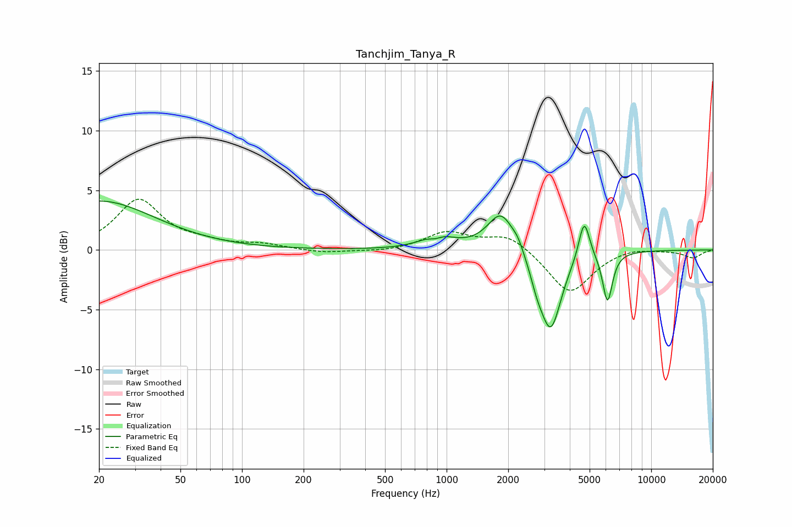

# Tanchjim_Tanya_R
See [usage instructions](https://github.com/jaakkopasanen/AutoEq#usage) for more options and info.

### Parametric EQs
Apply preamp of -4.2 dB when using parametric equalizer.

|   # | Type    |   Fc (Hz) |    Q |   Gain (dB) |
|-----|---------|-----------|------|-------------|
|   1 | Peaking |        20 | 0.52 |         4.1 |
|   2 | Peaking |       882 | 3.91 |        -0.6 |
|   3 | Peaking |       889 | 2.2  |         1.1 |
|   4 | Peaking |       941 | 1.52 |         0.3 |
|   5 | Peaking |      1847 | 2.16 |         3.3 |
|   6 | Peaking |      2232 | 5.36 |         0.6 |
|   7 | Peaking |      2761 | 4.23 |        -1.3 |
|   8 | Peaking |      3227 | 2.69 |        -6.6 |
|   9 | Peaking |      4702 | 5.27 |         3.4 |
|  10 | Peaking |      6116 | 5.73 |        -4.2 |

### Fixed Band EQs
When using fixed band (also called graphic) equalizer, apply preamp of **-4.4 dB** (if available) and set gains manually with these parameters.

|   # | Type    |   Fc (Hz) |    Q |   Gain (dB) |
|-----|---------|-----------|------|-------------|
|   1 | Peaking |        31 | 1.41 |         4.2 |
|   2 | Peaking |        62 | 1.41 |         0.5 |
|   3 | Peaking |       125 | 1.41 |         0.4 |
|   4 | Peaking |       250 | 1.41 |        -0.3 |
|   5 | Peaking |       500 | 1.41 |        -0.2 |
|   6 | Peaking |      1000 | 1.41 |         1.5 |
|   7 | Peaking |      2000 | 1.41 |         1.3 |
|   8 | Peaking |      4000 | 1.41 |        -3.7 |
|   9 | Peaking |      8000 | 1.41 |         0.3 |
|  10 | Peaking |     16000 | 1.41 |        -0.6 |

### Graphs

