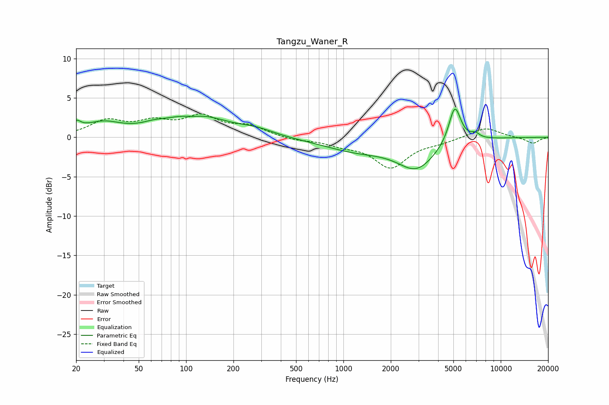

# Tangzu_Waner_R
See [usage instructions](https://github.com/jaakkopasanen/AutoEq#usage) for more options and info.

### Parametric EQs
Apply preamp of -3.7 dB when using parametric equalizer.

|   # | Type    |   Fc (Hz) |    Q |   Gain (dB) |
|-----|---------|-----------|------|-------------|
|   1 | Peaking |        20 | 4.83 |         1.1 |
|   2 | Peaking |        29 | 1.18 |         1.6 |
|   3 | Peaking |        62 | 2.06 |         0.4 |
|   4 | Peaking |       111 | 2.34 |        -0.4 |
|   5 | Peaking |       113 | 0.73 |         2.9 |
|   6 | Peaking |       279 | 1.27 |         0.7 |
|   7 | Peaking |      1226 | 0.63 |        -1.6 |
|   8 | Peaking |      2921 | 1.18 |        -3.6 |
|   9 | Peaking |      5105 | 3.62 |         4.9 |
|  10 | Peaking |      6892 | 4.83 |         0.6 |

### Fixed Band EQs
When using fixed band (also called graphic) equalizer, apply preamp of **-3.1 dB** (if available) and set gains manually with these parameters.

|   # | Type    |   Fc (Hz) |    Q |   Gain (dB) |
|-----|---------|-----------|------|-------------|
|   1 | Peaking |        31 | 1.41 |         2   |
|   2 | Peaking |        62 | 1.41 |         1.6 |
|   3 | Peaking |       125 | 1.41 |         2.4 |
|   4 | Peaking |       250 | 1.41 |         1.3 |
|   5 | Peaking |       500 | 1.41 |        -0.4 |
|   6 | Peaking |      1000 | 1.41 |        -0.8 |
|   7 | Peaking |      2000 | 1.41 |        -3.7 |
|   8 | Peaking |      4000 | 1.41 |        -0.5 |
|   9 | Peaking |      8000 | 1.41 |         1.3 |
|  10 | Peaking |     16000 | 1.41 |        -0.8 |

### Graphs

